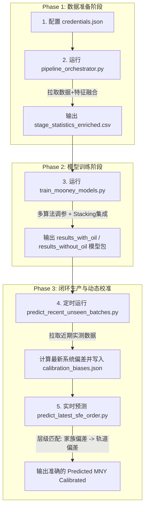

# 胶料门尼粘度预测与校准系统项目主指南 (Master Guide)

本文件是本项目（M1/R1 胶料门尼粘度预测与动态偏差校准）的全局操作说明与架构文档，旨在为工程师提供端到端的执行流程、目录结构、文件功能说明以及自动校准的详细指南。

---

## 1. 项目目录与文件清单 (Project Layout)

项目文件夹主要包含两层：项目根目录和 `data processing` 子目录。

### 1.1 项目根目录 (Root Directory)
| 文件名 | 类型 | 功能说明 |
| :--- | :--- | :--- |
| **`Mooney_Viscosity_Prediction_Master_Guide.md`** | 部署文档 | **项目主指南（当前文件）**，包含项目流程、运行顺序和校准逻辑。 |
| **`bias_calibration_guide.md`** | 技术指南 | 偏差校准（Bias Calibration）技术解析及定时任务设置指南。 |
| **`pipeline_orchestrator.py`** | Python 脚本 | **数据提取与整合主入口**，提取红石系统与 MMS 的原始数据，输出清洗映射后的 `stage_statistics_enriched.csv`。 |
| **`predict_recent_unseen_batches.py`** | Python 脚本 | **定期验证与校准生成脚本**，自动 query 红石最新检测结果，做基准预测，计算并保存偏差库，打印性能对比。 |
| **`1_Data_preparation_M1.py`** | Python 脚本 | 用于 M1/R1 数据清洗与结构化抽取的原始准备脚本。 |
| **`2_Feature_Engineering_M1.py`** | Python 脚本 | 用于提取曲线流变响应特征（如各阶段扭矩、转速均值/积分）的特征工程脚本。 |
| **`function_definitions_M1.py`** | Python 脚本 | 项目通用的物理交互项 and 曲线切割算法库。 |
| **`stage_statistics_enriched_all_features_weather_v4.csv`** | 训练数据集 | **模型训练核心数据集**，包含全部清洗好的 M1/R1 历史特征与门尼标签。 |
| **`results_recent_validation.csv`** | 数据输出 | 记录了最新盲测车次的基准预测、校准预测和真实标签的对比报告。 |
| **`HE M1.ipynb`** | Notebook | Jupyter 探索性数据分析（EDA）草稿。 |

### 1.2 `data processing/` 子目录
| 文件名 | 类型 | 功能说明 |
| :--- | :--- | :--- |
| **`train_mooney_models.py`** | 核心脚本 | **模型训练与调优脚本**。进行孤立森林异常过滤，通过 Optuna 自动寻找超参数，训练多模型集成（Ridge, RF, GBDT, XGB, LGBM, HistGBM, CatBoost），最后生成 Stacking 模型包。 |
| **`new_compound_inference.py`** | 核心库 | **预测库**。处理白炭黑门尼化学反应等 Gated 特征，进行适用性边界域（Applicability Domain）检测，并实现层级偏差校准查找逻辑。 |
| **`predict_latest_sfe_order.py`** | 运行脚本 | **生产线实时预测脚本**。连接 SFEPLANT SQL Server 获取当前正在运行的最新批次曲线，实时套用校准给出最新门尼预测。 |
| **`validate_recent_ce_gap.py`** | 辅助脚本 | 用于评估近期盲测中基准模型的拟合误差。 |
| **`compare_unified_vs_separated.py`** | 辅助脚本 | 用于对比多轨道（含油/无油）联合建模与分离建模性能的验证脚本。 |
| **`credentials.json`** | 敏感配置 | MMS (SQL Server) 和 MustangMaster (Redshift) 数据库的连接凭证。 |
| **`*.sql`** (如 `get master MNY test.sql`) | 查询语句 | 包含拉取生胶粘度、油投料时间、QM supplier 报告的 SQL 模版。 |

### 1.3 `results_with_oil/` 与 `results_without_oil/` （模型输出目录）
当 `train_mooney_models.py` 运行结束后，会在相应的文件夹下输出以下资产：
*   `mooney_model_bundle.joblib`：**可直接部署的模型文件包**，包含已拟合的 Stacking 模型、特征预处理器（Imputer & Scaler）以及特征选择掩码。
*   `mny_predictive_modeling_report.md`：详细的交叉验证、测试集性能评估报告。
*   `mooney_model_parity_plot.png` & `mooney_model_feature_importance.png`：散点图与特征贡献度图。
*   `interpretable_feature_audit.csv`：多维可解释性过滤与共线性审计表格。
*   `process_adjustment_guidance.csv`：前 25 个核心杠杆特征的物理方向指导表（Spearman 相关系数与控制杠杆类型）。

---

## 2. 从头到尾的完整运行顺序 (End-to-End Pipeline Workflow)

项目的生命周期分为三个阶段：**数据准备**、**模型训练**、**实时生产推理与自动校准**。



### 步骤 1：配置连接凭证
在 `data processing/credentials.json` 中配置合法的数据库登录凭证，确保可正常读取 SFEPLANT SQL Server 以及 MustangMaster PostgreSQL/Redshift。

### 步骤 2：数据提取与映射（Pipeline Run）
在项目根目录下运行数据流整合管道：
```bash
python pipeline_orchestrator.py
```
*   **输入**：数据库原始报表、Pallet 样品关系、QM 物料供应商检测数据。
*   **输出**：生成 `stage_statistics_enriched.csv` 格式文件。
*   **说明**：日常增量建模或全量数据刷新时执行此步骤。

### 步骤 3：多模型评估、调优与集成（Model Training）
在项目根目录下运行模型开发脚本：
```bash
python "data processing/train_mooney_models.py"
```
*   **运行逻辑**：
    1. 自动过滤异常点与负数段。
    2. 计算 Spearman 排列特征优先级，执行 $|r| > 0.90$ 强共线性剪枝。
    3. 调用 Optuna 在 LightGBM (Huber 损失) 和 XGBoost (稳定平方误差损失) 上运行 25 次超参数搜索。
    4. 执行 Ridge、RandomForest、HistGBM、CatBoost、XGBoost、LightGBM 基准交叉验证对比，并输出**无 nan 的完整评估指标表**。
    5. 构建多算法混合 StackingRegressor 集成模型，自动输出物理调整指导书与模型 bundle 包。

### 步骤 4：生成动态校准库（偏差自适应）
部署后的校准闭环。配置 Windows 定时任务（如每天或每周）自动运行：
```bash
python predict_recent_unseen_batches.py --days 14 --max-tests 15
```
*   **逻辑**：它会把最近 14 天的实测样品的基准预测与红石实测值做均值比对，计算系统发生的漂移（$\Delta$），并生成动态校准库 `results_m2_analysis/calibration_biases.json`。
*   **对比报告**：自动计算并在控制台展示 Base vs. Calibrated 盲测性能提升幅度。

### 步骤 5：车间在线门尼粘度预测
密炼控制台或实时监测程序运行：
```bash
python "data processing/predict_latest_sfe_order.py"
```
*   **实时推理**：提取 SFEPLANT 当前第一车的传感器曲线特征，传入 `new_compound_inference.py`。
*   **层级校准应用**：脚本将自动在 `results_m2_analysis/calibration_biases.json` 中执行**家族前缀模糊匹配**。若无，自动退化到**轨道级（含油/无油）偏差校准**，最后实时打印与保存 `Predicted MNY (Calibrated)`。

---

## 3. 动态偏差校准系统说明 (Integrated Bias Calibration Guide)

为了应对以下生产实际情况，我们引入了动态校准：
1.  **原材料批次漂移**：当换用新批次的橡胶时，基础模型仅能捕捉特征变化，偏差校准能有效对冲由于生机出厂粘度漂移导致的 2 - 5 MNY 整体偏离。
2.  **实验室仪器漂移**：门尼仪的定期清理、磨损和压腔滑移在近期会形成系统性偏大/偏小的趋势误差。
3.  **零点微调机理**：我们在估计偏差时仅使用单参数（均值差 $\Delta$），不改变模型的拟合面方向。即使测试样本只有 2-3 车，根据中心极限定理也能达到高精度定位，避免过拟合。

### 3.1 校准前后的性能差距对比（盲测 15 车）
通过本动态校准体系，在 2026 年 6 月初的盲测结果中，性能指标实现了跨越式的提高：

| 评估指标 | 基础物理集成模型 (Base Model) | 偏差自适应校准模型 (Calibrated Model) |
| :--- | :---: | :---: |
| **平均绝对误差 (MAE)** | 3.8894 MNY | **1.4490 MNY** (降幅 **62.7%**) |
| **均方根误差 (RMSE)** | 5.1151 MNY | **1.8555 MNY** (降幅 **63.7%**) |
| **平均偏置 (Bias)** | +2.0123 MNY | **+0.2177 MNY** (向 0 趋近) |

*(数据来自最近 14 天 Without-Oil 轨道在实际生产曲线上的跟踪表现)*
