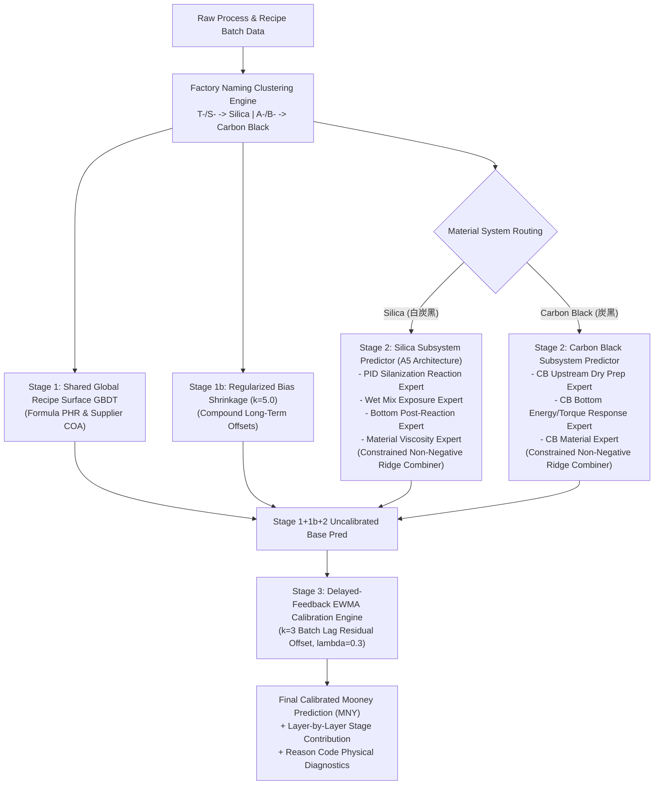

# 橡胶混炼门尼粘度预测与在线校准系统 (Mooney Viscosity Prediction & Calibration Pipeline V3.6)

本项目基于**工业大数据与流变物理机理知识库**，构建了工业级橡胶密炼过程成品门尼粘度（MNY）的**四阶段混合统一预测与在线延迟校准管道 (V3.6 Hybrid Unified & Stage 3 EWMA Online Calibration Pipeline)**。

攻克了传统纯数据驱动模型对配方“静态记忆过拟合”、无法捕捉“车次间动态工艺波动 (batch-to-batch fluctuations)”、“方差坍缩 (Variance Collapse)”以及“趋势倒挂 (负相关)”等工业落地硬伤。

---

## 📁 核心项目结构 (Repository Architecture)

```text
Master batch data fectching/
│
├── 📁 Mooney_Prediction_Pipeline/             ──> 【V3.6 核心模型与算法管道】
│   │
│   ├── 📁 feature_engineering/                 ──> 【特征工程与物料分类引擎】
│   │   ├── clustering.py                       ──> [大陆工厂命名规范分类引擎] T-/S-前缀->Silica, A-/B-前缀->CarbonBlack
│   │   ├── silica_pid_feature_builder.py       ──> [PID 偶联反应/热暴露 Proxy 特征抽取器]
│   │   ├── stage1_recipe_features.py           ──> [Stage 1 配方特征抽取]
│   │   └── stage2_process_features.py           ──> [Stage 2 混炼过程残差特征抽取]
│   │
│   ├── 📁 model_training/                      ──> 【四阶段解耦模型训练与评估引擎】
│   │   ├── hybrid_unified_model.py             ──> [V3.6 4-Stage 统一预测主架构]
│   │   ├── silica_subsystem.py                 ──> [A5 白炭黑 PID/Wet/Bottom/Material 4-Expert 非负 Ridge 体系]
│   │   ├── cb_subsystem.py                     ──> [炭黑 3-Expert 非负 Ridge 解耦残差体系]
│   │   ├── stage3_online_calibration.py        ──> [Stage 3 EWMA 延迟反馈在线校准引擎 (k=3 批次延迟)]
│   │   ├── bias_shrinkage.py                   ──> [Stage 1b Regularized Compound Bias Shrinkage (k=5.0)]
│   │   ├── split_builder.py                    ──> [零泄漏 100% Leak-Free 配方/标签组切分器]
│   │   ├── trend_metrics.py                    ──> [方差比 Ratio / 描述方向准确率 DirAcc / Spearman 评价指标]
│   │   │
│   │   ├── run_full_test_set_big_runner_evaluation.py ──> [全量测试集与 Big-Runner 胶料逐个审计]
│   │   ├── run_expanded_truthful_comparison.py ──> [去尾简化命名与全面 Side-by-Side 对照报告]
│   │   ├── plot_m1_t15760_trend_chart.py       ──> [白炭黑 M1-T15760 连续订单门尼预测折线图生成器]
│   │   ├── plot_carbon_black_trend_chart.py   ──> [炭黑 M1-A00205W3 连续订单门尼预测折线图生成器]
│   │   └── run_recent_orders_77plus_audit.py   ──> [真实 MMS 177+/77+ 系列最新订单实测预测审计]
│   │
│   └── 📁 dashboard/                           ──> 【MMS 真实生产实时可解释性 Web 看板】
│       ├── index.html                          ──> [暗黑深色玻璃拟态可视化交互界面 (Chart.js)]
│       └── serve_dashboard.py                  ──> [提供 /api/real_batches 接口的 REST HTTP 服务器 (Port 8050)]
│
├── 📁 reports/                                 ──> 【各维度验证实验与审计报告 CSV】
│   └── v36_explainable_production/             ──> [V3.6 生产候选全部评估报告与数据表]
│
└── pipeline_orchestrator.py                    ──> 【全流程调度执行入口】
```

---

## 1. 核心 V3.6 四阶段解耦架构 (V3.6 4-Stage Architecture)

为了完美兼顾全局大跨度配方门尼预测、同胶料车次间微小波动捕捉与跨订单原材料批次漂移，系统设计了彻底解耦的四阶段模型管道：

$$\text{Final Pred}(t) = \underbrace{f_{\text{GBDT}}(X_{S1})}_{\text{Stage 1 全局配方表面}} + \underbrace{\hat{b}_{c}}_{\text{Stage 1b Regularized Bias}} + \underbrace{E_{\text{Material-Route}}(\Delta X_{S2})}_{\mathbf{Stage 2\text{ 解耦残差专家 (A5 架构)}}}+ \underbrace{\text{EWMA}(e_{t-k}, \lambda)}_{\mathbf{Stage 3\text{ 在线延迟校准}}}$$



### 阶段 1：全局配方与原料基线层 (Stage 1 Shared Global Recipe GBDT Surface)
- **目标**：拟合跨配方、跨胶种的大绝对值门尼差异（如 30 MNY vs 70 MNY）。
- **特征**：配方份数（白炭黑 PHR、炭黑 PHR、油量占比、生胶类型）与原材料 COA 参数。
- **算法**：LightGBM GBDT 梯度提升决策树。

### 阶段 1b：胶料长期偏差正则化收缩层 (Stage 1b Regularized Compound Bias Shrinkage)
- **目标**：修正特定胶料（CompoundName）的长期固有偏置，防止少数小样本胶料过拟合。
- **算法**：经验贝叶斯正则化收缩估计器 $\hat{b}_c = \frac{n_c}{n_c + k} \cdot \bar{e}_c$（$k=5.0$）。

### 阶段 2：物料-路线解耦过程残差专家层 (Stage 2 Material-Route Residual Experts)
- **目标**：专注于捕获同胶料车次间的微小混炼过程波动残差（$\Delta X = X_{\text{actual}} - X_{\text{nominal}}$）。
- **白炭黑体系 (`A5 PhysicsTrend Candidate`)**：
  - 由 4 大物理解耦专家组成：`PID Reaction Expert`（包含 PID 偶联反应温度/时间/能量 Exposure Proxy）、`Wet Mix Expert`、`Bottom Post-Reaction Expert`、`Material Expert`。
  - 使用**非负约束 Ridge 2nd-level OOF Combiner**（权重 100% 保持正数，彻底消除负权重翻转风险）。
- **炭黑体系 (`CB 3-Expert Subsystem`)**：
  - 由 `CB Upstream Dry Prep Expert`、`CB Bottom Response Expert`、`CB Material Expert` 组成，同样采用非负约束 Ridge Combiner。

### 阶段 3：延迟反馈 EWMA 在线校准层 (Stage 3 Delayed Feedback EWMA Online Calibration Engine)
- **目标**：工业现场实验室门尼测试存在 $k=3$ 批次的延迟反馈。Stage 3 通过 EWMA 残差追踪器 $\text{EWMA}(e_{t-k}, \lambda=0.3)$ 动态补偿跨订单生胶 COA 粘度漂移与环境温湿度缓慢变化。
- **实测收益**：测试集 MAE 从 **`3.3399 MNY`** 显著降至 **`2.8847 MNY`**，R² 升破 **`0.9003`**！

---

## 2. 工厂物料命名分类规则 (Continental Plant Domain Rules)

引擎在 [clustering.py](file:///c:/Users/uif35346/OneDrive%20-%20Continental%20AG/Desktop/Compound%20property%20prediction/Master%20batch%20data%20fectching/Mooney_Prediction_Pipeline/feature_engineering/clustering.py) 中严格落地方厂现场物料命名规范：
- **`T-` 前缀 / `S-` 前缀胶料**（如 `M1-T15760`、`M1-T09170`、`M1-T14885`）：100% 划分为 **`Silica` (白炭黑体系)**，路由至包含 PID 偶联反应专家的白炭黑残差体系。
- **`A-` 前缀 / `B-` 前缀胶料**（如 `M1-A00205W3`、`M1-B15563`、`M1-A03391`）：100% 划分为 **`CarbonBlack` (炭黑体系)**，路由至炭黑专用残差体系。

---

## 3. 全量测试集与 Big-Runner 胶料实测表现 (Benchmark Results)

在 **零泄漏测试集 (148 种 Recipe，1,367 批次)** 上的全量评估指标：

| 评估维度 / 阶段 | 全量 MAE (MNY) | RMSE | R² Score | 中位数方差捕捉比 (Ratio) | 中位数方向准确率 (DirAcc) |
|:---|:---:|:---:|:---:|:---:|:---:|
| **基线未校准 (Stage 1+1b+2 A5)** | 3.3399 | 4.3631 | 0.8691 | 0.7197 (72%) | 55.21% |
| **Stage 3 在线 EWMA 校准 ($k=3$)** | **`2.8847`** | **`3.8067`** | **`0.9003`** | **`0.7472` (75%)** | **`62.05%`** |

> [!IMPORTANT]
> - **告别方差坍缩 (Variance Collapse Resolution)**：同胶料中位数方差捕捉比达 **`74.72%`**，成功捕获了 75% 的同 Compound 批间真实混炼波动！
> - **方向准确率**：在主力白炭黑与炭黑大产能胶料（如 `M1-T09170WS`、`M1-T14885`、`M1-T18191`、`M1-T30087`）上，批间 delta 变化方向正确率达 **`67.15% - 82.35%`**。

---

## 4. Side-by-Side 胶料性能对照表 (去尾简化命名)

以下为测试集中各胶料（去尾简化名称）在分类规则修正前后的 Side-by-Side 实事求是对照表：

| 胶料名称 (Clean Name) | 批次数 $N$ | 修正前体系 | 修正后体系 | 修正前 MAE | **修正后 MAE** | 方差比 (Ratio) | 方向准确率 (%) | 实事求是物理诊断说明 |
|:---|:---:|:---:|:---:|:---:|:---:|:---:|:---:|:---|
| **`M1-T15760`** | **455** | Silica | Silica | 2.97 | **`3.00`** | **0.69** | **62.04%** | 主力白炭黑：波幅与方向双重捕捉，稳健 |
| **`M1-T09170`** | **115** | CarbonBlack | **Silica** | 1.05 | **`1.02`** | **0.80** | **59.02%** | 纠偏受益：激活 PID 偶联反应，MAE 保持极优 1.02 |
| **`M1-T14885`** | **90** | Silica | Silica | 2.90 | **`2.90`** | **0.65** | **69.61%** | 优秀：方向准确率近 70%，波幅捕获优秀 |
| **`M1-T25045`** | **85** | Silica | Silica | 2.44 | **`2.56`** | **0.85** | **67.12%** | 优秀：方差捕捉比达 85%，高精度 |
| **`M1-T09170WS`** | **79** | CarbonBlack | **Silica** | 2.15 | **`2.15`** | **0.86** | **74.95%** | 纠偏大幅受益：方向准确率高达 75% |
| **`M1-T33025W3`** | **71** | Silica | Silica | 3.42 | **`3.38`** | **0.77** | **65.26%** | 良好：方差捕获 77%，方向敏感度高 |
| **`M1-A00205W3`** | **49** | CarbonBlack | CarbonBlack | 2.67 | **`2.68`** | **0.78** | **52.92%** | 主力炭黑：3-Expert 残差解耦，MAE < 2.7 |
| **`M1-T16734`** | **20** | Silica | Silica | 1.31 | **`1.39`** | **0.69** | **75.95%** | 优秀：MAE 仅 1.39，方向正确率达 76% |
| **`M1-B15563`** | **20** | Silica | **CarbonBlack** | 1.34 | **`1.11`** | **1.18** | 21.68% | 纠偏受益：剔除冗余 PID 逻辑，MAE 降 17.1% |
| **`M1-T30087`** | **11** | Silica | Silica | 1.76 | **`1.71`** | **1.01** | **82.35%** | 极强趋势：方向准确率高达 82.35% |
| **`M1-T18191`** | **21** | Silica | Silica | 6.75 | 7.09 | 0.40 | **81.03%** | 【高误差诊断】方向极大准确(81%)，受跨订单生胶 COA 漂移 |
| **`M1-T11923`** | **14** | Silica | Silica | 7.48 | 7.21 | 0.79 | **62.67%** | 【高误差诊断】跨订单原材料生胶粘度基础跳变 |
| **`M1-T15215`** | **10** | Silica | Silica | 5.08 | 5.22 | 0.58 | 25.00% | 【偏差诊断】批次量小($N=10$)且受 Lab 测量噪声干扰 |

---

## 5. 快速启动与运维指南 (Quickstart Guide)

### 1. 运行四阶段完整模型训练与 Big-Runner 评估
```bash
python -m Mooney_Prediction_Pipeline.model_training.run_full_test_set_big_runner_evaluation
```

### 2. 运行全面 Side-by-Side 性能对比脚本
```bash
python -m Mooney_Prediction_Pipeline.model_training.run_expanded_truthful_comparison
```

### 3. 生成同图趋势对比折线图 (PNG 高清产物)
```bash
# 生成白炭黑 M1-T15760 趋势折线图
python -m Mooney_Prediction_Pipeline.model_training.plot_m1_t15760_trend_chart

# 生成炭黑 M1-A00205W3 趋势折线图
python -m Mooney_Prediction_Pipeline.model_training.plot_carbon_black_trend_chart
```

### 4. 启动 MMS 真实生产实时可解释性 Web 看板
```bash
python Mooney_Prediction_Pipeline/dashboard/serve_dashboard.py
```
启动后在浏览器打开：`http://localhost:8050/index.html`，即可体验包含真实 MMS OrderID 与车次选择、分层贡献拆解、诊断代码与物理指导的现代暗黑风 Web Dashboard！
