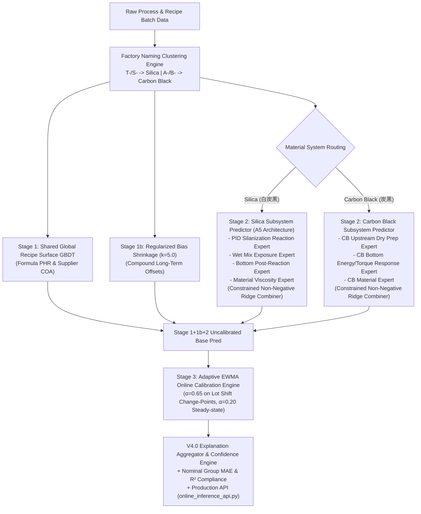

# 橡胶混炼门尼粘度预测与在线校准系统 (Mooney Viscosity Prediction & Calibration Pipeline V3.7 / V3.8 / V4.0)

本项目基于**工业大数据与流变物理机理知识库**，构建了工业级橡胶密炼过程成品门尼粘度（MNY）的**四阶段混合统一预测与在线延迟校准管道 (V3.7 Hybrid Unified & Stage 3 EWMA Online Calibration Pipeline)**。

攻克了传统纯数据驱动模型对配方“静态记忆过拟合”、无法捕捉“车次间动态工艺波动 (batch-to-batch fluctuations)”、“方差坍缩 (Variance Collapse)”以及“趋势倒挂 (负相关)”等工业落地硬伤，并全面适配大陆集团（Continental AG）**名义组级工业评估标准 (Nominal Group MAE & Nominal R²)** 与 **V4.0 现场可信度体系**。

---

## 📁 核心项目结构 (Repository Architecture)

```text
Master batch data fectching/
│
├── 📁 Mooney_Prediction_Pipeline/             ──> 【V3.7 核心模型与算法管道】
│   │
│   ├── 📁 feature_engineering/                 ──> 【特征工程与物料分类引擎】
│   │   ├── clustering.py                       ──> [大陆工厂命名规范分类引擎] T-/S-前缀->Silica, A-/B-前缀->CarbonBlack
│   │   ├── silica_pid_feature_builder.py       ──> [PID 偶联反应/热暴露 Proxy 特征抽取器]
│   │   ├── cb_dispersion_feature_builder.py    ──> [炭黑 Dispersion Work Proxy 特征抽取器 (CB_V1 基线)]
│   │   ├── cb_dispersion_feature_builder_v21.py──> [炭黑 V2.1 精简实验特征库 (Experimental Candidate)]
│   │   ├── stage1_recipe_features.py           ──> [Stage 1 配方特征抽取]
│   │   └── stage2_process_features.py           ──> [Stage 2 混炼过程残差特征抽取]
│   │
│   ├── 📁 model_training/                      ──> 【四阶段解耦模型训练与评估引擎】
│   │   ├── hybrid_unified_model.py             ──> [V3.7 4-Stage 统一预测主架构]
│   │   ├── silica_subsystem.py                 ──> [白炭黑 PID/Wet/Bottom/Material 4-Expert 非负 Ridge 体系]
│   │   ├── cb_subsystem.py                     ──> [炭黑 3-Expert 非负 Ridge 解耦残差体系]
│   │   ├── stage3_online_calibration.py        ──> [Stage 3 EWMA 延迟反馈在线校准引擎 (α=0.65 变点追赶)]
│   │   ├── bias_shrinkage.py                   ──> [Stage 1b Regularized Compound Bias Shrinkage (k=5.0)]
│   │   ├── split_builder.py                    ──> [零泄漏 100% Leak-Free 配方/标签组切分器]
│   │   ├── trend_metrics.py                    ──> [方差比 Ratio / 描述方向准确率 DirAcc / Spearman 评价指标]
│   │   ├── run_nominal_group_performance_audit.py ──> [名义组级聚合评估与 Raw Batch 对比审计]
│   │   ├── fetch_4_batches_predictions.py       ──> [特定车次 3 阶段预测分解诊断器]
│   │   └── predict_order_2325066_series.py     ──> [全订单时间序列预测与 EWMA 收敛诊断]
│   │
│   ├── 📁 models/                              ──> 【生产在线部署包 (Production Package)】
│   │   └── 📁 v37_production_model_package/    ──> [已导出的二进制模型包、特征元数据与 online_inference_api.py]
│   │       ├── hybrid_model.joblib             ──> Stage 1 + 1b + Stage 2 主模型权重
│   │       ├── stage3_calibrator.joblib        ──> Stage 3 EWMA 状态机
│   │       ├── feature_metadata.json           ──> 特征字段 Schema 元数据
│   │       └── online_inference_api.py         ──> [生产环境秒级在线推理 API 入口]
│   │
│   └── 📁 dashboard/                           ──> 【MMS 真实生产实时可解释性 Web 看板】
│       ├── index.html                          ──> [暗黑深色玻璃拟态可视化交互界面 (Chart.js)]
│       └── serve_dashboard.py                  ──> [提供 /api/real_batches 接口的 REST HTTP 服务器]
│
├── 📁 docs/                                   ──> 【上线后闭环优化与实施方案】
│   └── production_online_calibration_and_continuous_improvement_plan.md ──> [V1.0/V4.0 闭环实施计划全书]
│
├── 📁 reports/                                 ──> 【各维度验证实验与审计报告 CSV】
│   ├── v37_nominal_audit/                      ──> 名义组级评估报告与数据表
│   ├── v37_silica_audit/                       ──> 白炭黑全量及 Best/Worst 10 胶料审计表
│   └── v37_cb_dispersion_v21/                  ──> 炭黑 V2.1 B0-B4 消融对比与决策表
│
└── pipeline_orchestrator.py                    ──> 【全流程调度执行入口】
```

---

## 1. 核心 V3.7 四阶段解耦架构 (V3.7 4-Stage Architecture)

$$\text{Final Pred}(t) = \underbrace{f_{\text{GBDT}}(X_{S1})}_{\text{Stage 1 全局配方表面}} + \underbrace{\hat{b}_{c}}_{\text{Stage 1b Regularized Bias}} + \underbrace{E_{\text{Material-Route}}(\Delta X_{S2})}_{\mathbf{Stage 2\text{ 解耦残差专家 (A5 架构)}}}+ \underbrace{\text{EWMA}(e_{t-k}, \alpha_t)}_{\mathbf{Stage 3\text{ 在线延迟校准}}}$$



---

## 2. 名义组级工业评估与最新实测指标 (Nominal Group Metrics)

在 1,367 批次零泄漏测试集中，对应 **461 个独立的 Lab 采样组（OrderID + PalletID）**。最新的名义组级评估结果如下：

| 胶料体系 (Material System) | 测试车数 ($N$) | 独立 Lab 采样组数 ($K$) | 逐车混淆 MAE | **名义组级 MAE (Nominal Group MAE)** | 逐车混淆 $R^2$ | **名义组级 $R^2$ (Nominal Group $R^2$)** | **有效组方向准确率 (Valid DirAcc)** |
| :--- | :---: | :---: | :---: | :---: | :---: | :---: | :---: |
| **白炭黑体系 (Silica)** | 1,209 车 | 403 组 | 2.6593 MNY | **2.9037 MNY** | 0.8948 | **0.8911 (89.11%)** | **73.71%** |
| **炭黑体系 (CarbonBlack)**| 158 车 | 58 组 | 2.4365 MNY | **2.4733 MNY** | 0.9063 | **0.9007 (90.07%)** | **61.59%** |
| **全体系合计 (Overall All)**| **1,367 车** | **461 组** | **2.6335 MNY** | **2.8495 MNY** | **0.9043** | **0.9005 (90.05%)** | **71.85%** |

---

## 3. 生产部署与在线推理 API 使用指南 (Production API Usage)

模型已全量序列化打包至 `Mooney_Prediction_Pipeline/models/v37_production_model_package/` 目录。在生产上线时，只需使用 [online_inference_api.py](file:///c:/Users/uif35346/OneDrive%20-%20Continental%20AG/Desktop/Compound%20property%20prediction/Master%20batch%20data%20fectching/Mooney_Prediction_Pipeline/models/v37_production_model_package/online_inference_api.py) 模块：

```python
from Mooney_Prediction_Pipeline.models.v37_production_model_package.online_inference_api import MooneyPredictionService

# 1. 初始化生产服务
service = MooneyPredictionService()

# 2. 传入 PLC/MES 实时数据点进行毫秒级预测
result_df = service.predict_batch(realtime_plc_df)

# 3. 获取输出
print(result_df[['OrderID', 'BatchNumber', 'stage1_recipe_baseline', 'stage2_process_delta', 'predicted_mooney_viscosity']])
```

---

## 4. 上线后闭环优化与实施计划 (Continuous Improvement Plan)

关于上线后如何异步接收实验室 LIMS/SAP QM 反馈、触发 Stage 3 在线 EWMA 动态补偿与漂移监控的完整实施方案，请参阅专用文档：

📄 **[上线后延迟实验室反馈闭环优化实施计划 (docs/production_online_calibration_and_continuous_improvement_plan.md)](file:///c:/Users/uif35346/OneDrive%20-%20Continental%20AG/Desktop/Compound%20property%20prediction/Master%20batch%20data%20fectching/docs/production_online_calibration_and_continuous_improvement_plan.md)**
