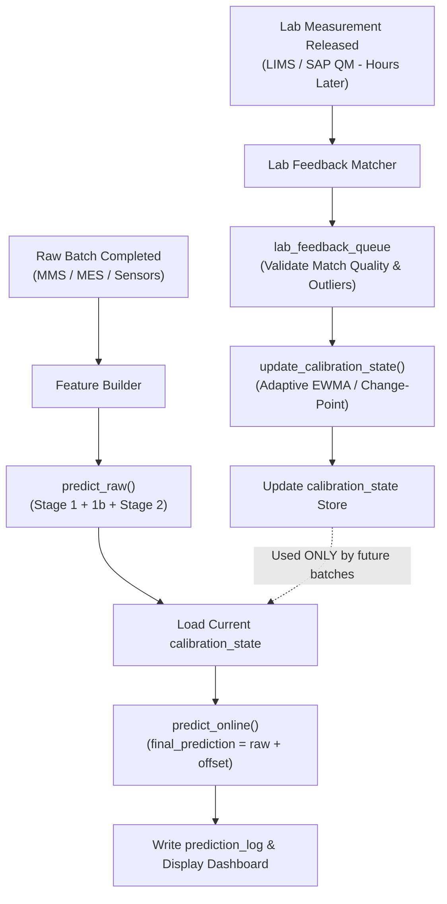
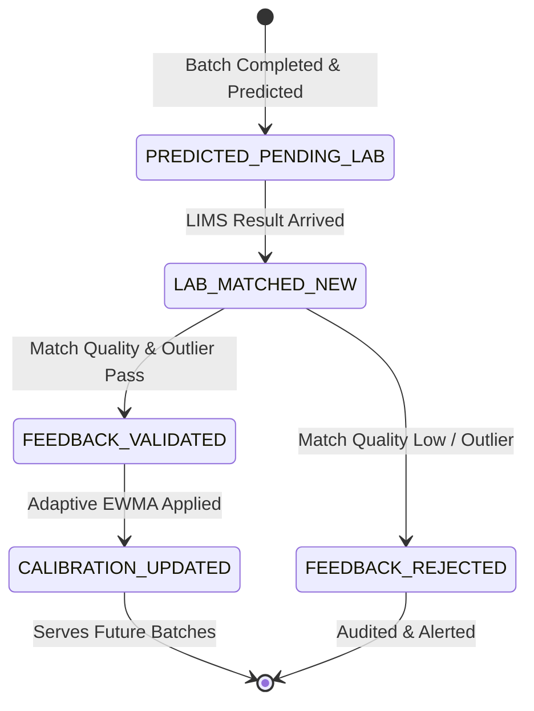
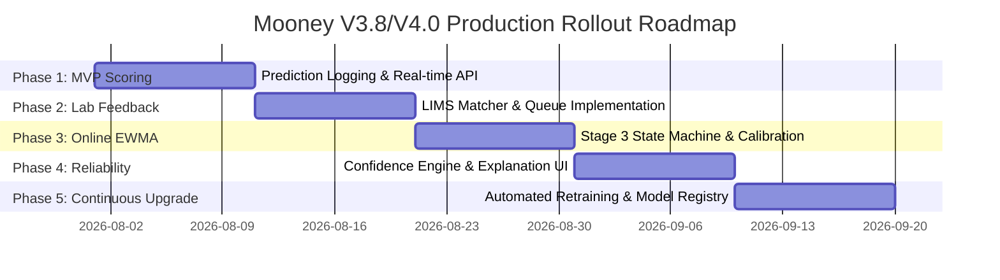

# 门尼粘度预测系统上线后延迟实验室反馈闭环优化实施计划
## V1.0 · Production Online Calibration & Continuous Improvement Plan (V3.8 / V4.0 Specification)

> **适用范围**：Mooney V3.6 / V3.8 / V4.0 生产模型上线、实验室延迟反馈闭环、在线校准状态机、漂移监控、模型版本升级治理与现场可信度体系。  
> **核心原则**：当前批次预测时**绝不使用**当前批次实验室 MNY。实验室结果在数小时后进入数据库时，只能写入 `lab_feedback_queue` 并调用 `update_calibration_state()` 更新在线校准状态 `calibration_state`，仅服务于后续批次。系统严格保留 `raw_prediction` 与 `final_prediction` 的原始审计日志，禁止改写或篡改历史预测。

---

## 1. 业务与系统元数据

| 项目 | 说明 |
| :--- | :--- |
| **文档类型** | 生产部署与闭环优化实施方案 (Production Implementation & Closed-Loop Calibration Plan) |
| **角色定位** | 模型部署专家 / 工业 AI 系统架构师 / Mooney Prediction 项目实施指南 |
| **核心对象** | `prediction_log`、`lab_feedback_queue`、`calibration_state`、`online calibration`、`monitoring dashboard`、`confidence engine` |
| **生成日期** | 2026-07-30 |

---

## 2. 执行摘要 (Executive Summary)

### 2.1 上线后的系统目标
模型上线后不只是输出一个离线 Mooney 预测值，而是形成 **“准实时预测 → 实验室延迟反馈 → 校准状态更新 → 后续批次补偿 → 监控与再训练”** 的完整工业闭环系统。

系统从单纯的“预测器”升级为 **可审计、可校准、可监控的 Mooney Risk Monitoring & Explanation System (门尼风险监控与可解释系统)**。

### 2.2 实验室延迟反馈的核心机制 (Pre-Lab Prediction & Post-Lab Calibration)
* **Pre-Lab 预测**：实验室 MNY 通常不会实时进入数据库（存在 15 分钟至数小时延迟）。在实验室结果未到达时，系统仍须输出初始预测值、风险等级、置信度区间（Confidence Interval）与主导物理原因码（Reason Codes）。
* **Post-Lab 校准**：实验室结果回流后，不应用来修改当时已经输出的预测值，而是写入 `lab_feedback_queue`。通过 `update_calibration_state()` 增量更新在线校准状态 `calibration_state`，仅用于后续同类批次的偏差补偿。

### 2.3 四阶段模型职责划解

| 阶段 (Stage) | 职责定位 (Responsibility) | 上线后是否实时可用 | 说明 (Description) |
| :--- | :--- | :---: | :--- |
| **Stage 1** | Recipe / COA / Material baseline | **是** | 决定胶料长期基础 Mooney 水平与跨配方大绝对值。 |
| **Stage 1b** | Compound / Cluster bias shrinkage | **是** | 正则化收缩估计器（$k=5.0$），修正特定胶料长期偏置。 |
| **Stage 2** | PID / Wet / Bottom / Material / CB experts | **是** | 解释 batch-to-batch 微小混炼工艺波动与做工积分。 |
| **Stage 3** | Delayed lab-feedback calibration | **是** *(使用历史已释放反馈)* | **不读取当前 batch Lab MNY**，仅使用历史已释放反馈更新 offset。 |

---

## 3. 生产闭环总体架构 (System Architecture)

系统划分为 5 个核心生产组件：



### 5 大核心组件职责定义：

| 组件名称 (Component) | 主要输入 (Inputs) | 主要输出 (Outputs) | 核心职责 (Responsibilities) |
| :--- | :--- | :--- | :--- |
| **Feature Builder** | MMS/MES/SQL、配方、阶段曲线、环境、COA | `feature table` | 准实时提取特征，进行缺失值补全与数据质量标记。 |
| **Prediction Job / Service** | Feature Table + Model Bundle + `calibration_state` | `prediction_log`, `batch_risk_result` | 准实时输出预测、置信度与原因码，不等待实验室结果。 |
| **Lab Feedback Matcher** | `prediction_log` (PENDING) + LIMS DB 新结果 | `lab_feedback_queue` | 异步匹配延迟到达的 Lab MNY 到历史预测记录。 |
| **Calibration Engine** | `lab_feedback_queue` (NEW 记录) | `calibration_state`, `calibration_event_log` | 运行 Adaptive EWMA 与变点检测，更新未来偏移补偿。 |
| **Monitoring Dashboard** | `prediction_log`, `calibration_state`, Lab Feedback | Power BI / Web App KPI | 监控名义 MAE、Nominal $R^2$、延迟、低置信度比例与漂移。 |

---

## 4. 上线后四条核心流水线 (Core Pipelines)

### 4.1 Pipeline A：准实时预测流水线 (Real-Time Scoring Pipeline)
* **触发**：新 batch 混炼完成或密炼机排胶信号。
* **动作**：生成特征 $\rightarrow$ `predict_raw()` $\rightarrow$ 读取最新 `calibration_state` $\rightarrow$ `predict_online()` $\rightarrow$ 写入 `prediction_log`。
* **结果**：即使实验室未出结果，现场看板仍能秒级看到预测门尼、风险等级、置信度区间、校准来源与 Top 原因码。

### 4.2 Pipeline B：实验室结果延迟回流流水线 (Asynchronous Lab Matcher Pipeline)
* **触发**：定期定时任务（如每 5 分钟）扫描 LIMS / SAP QM 数据库新增结果。
* **动作**：匹配 `prediction_log` 中 `lab_status = PENDING` 的记录，生成 `lab_feedback_queue`。
* **设计**：采用“预测先写入留痕、结果异步匹配”的双相设计。

### 4.3 Pipeline C：在线校准状态更新流水线 (Online Calibration Engine Pipeline)
* **触发**：`lab_feedback_queue` 出现 `feedback_status = NEW` 的记录。
* **动作**：计算 `raw_error` 与 `online_error`，校验匹配质量与异常值，调用 `update_calibration_state()`。
* **法则**：**更新仅影响后续批次，绝不覆盖改写当时已产生的 `final_prediction`**。

### 4.4 Pipeline D：监控与漂移检测流水线 (Monitoring & Drift Alerts Pipeline)
* **触发**：按班次、每日或滚动窗口汇总。
* **动作**：输出模型健康、校准健康、Lab 延迟分布、特征漂移、低置信度比例与 Fallback 比例。

---

## 5. 实验室延迟反馈运行状态机 (State Machine)



| 状态代号 (Status) | 定义 (Definition) | 系统行为 (System Action) | 前端与看板展示 (UI Display) |
| :--- | :--- | :--- | :--- |
| **`PREDICTED_PENDING_LAB`** | 预测已生成，Lab MNY 未进库 | 使用当前 `calibration_state` 输出 `final_prediction` | `Lab Pending`；显示置信度与校准来源 |
| **`LAB_MATCHED_NEW`** | Lab MNY 已进库，已匹配预测 | 写入 `lab_feedback_queue`，等待质量校验 | `Actual Available`；`Calibration Pending` |
| **`FEEDBACK_VALIDATED`** | 匹配质量与异常校验通过 | 计算 `raw_error` / `online_error` | `Feedback Validated` |
| **`CALIBRATION_UPDATED`** | `calibration_state` 已更新 | 更新 offset，未来批次使用新补偿量 | `Feedback Consumed`；显示校准事件 |
| **`FEEDBACK_REJECTED`** | 匹配失败或属于极端异常值 | 不更新校准状态，记录拒绝原因码 | `Rejected with Reason` |

---

## 6. Stage 3 自适应 EWMA 在线校准算法设计 (Adaptive EWMA)

### 6.1 误差公式定义

$$\text{raw\_prediction} = f_{\text{Stage1}}(X) + \hat{b}_c + f_{\text{Stage2}}(\Delta X)$$

$$\text{final\_prediction} = \text{raw\_prediction} + \text{calibration\_offset}$$

$$\text{raw\_error} = \text{lab\_actual\_mny} - \text{raw\_prediction}$$

$$\text{online\_error} = \text{lab\_actual\_mny} - \text{final\_prediction}$$

### 6.2 Adaptive EWMA 变点更新公式

$$\text{new\_bias} = (1 - \alpha_t) \cdot \text{old\_bias} + \alpha_t \cdot \text{raw\_error}$$

#### 自适应更新系数 $\alpha_t$ 选择逻辑表：

| 生产与数据场景 (Scenario) | 建议 $\alpha_t$ | 算法逻辑与物理原因 (Physics & Rationale) |
| :--- | :---: | :--- |
| **变点触发 (Change Point)**<br>*(连续残差 $|\Delta e| \ge 2.0\text{ MNY}$)* | **`0.60`** | **快速追赶模式**：原材料批次切换或生胶出厂门尼跳变，加速 1~2 车收敛。 |
| **低频 / 小批量胶料** | **`0.40`** | 需要更快吸收少量有限的反馈数据。 |
| **默认稳态生产 (Default)** | **`0.25`** | 平衡稳态降噪与动态追踪。 |
| **高频稳定胶料 (High Volume)** | **`0.15`** | **平滑降噪模式**：过滤实验室测试高频随机噪声。 |
| **匹配质量低 / 疑似离群值** | **`0.00`** *(拒绝)* | 拒绝无效反馈，防止污染在线校准状态。 |

---

## 7. Label Group 场景处理法则 (Label Group Handling)

在橡胶生产中，一个物理 Lab MNY 测量值通常对应整托盘/整订单的多车胶料（例如 4-10 车共用一个检验值）。

```
[Lab Test Value: 41.65 MNY] ─── (Matches Order 2325066, Pallet 001)
                                      │
                                      ├── Batch 1 (prediction_log entry)
                                      ├── Batch 2 (prediction_log entry)
                                      ├── Batch 3 (prediction_log entry)
                                      └── Batch 4 (prediction_log entry)
```

### 4 大处理原则：

1. **模型训练**：同组 batch 使用 $\text{sample\_weight} = 1.0 / \text{group\_size}$ 或名义组聚合模式。
2. **上线预测**：保持 batch-level 预测与 stage contribution 解释，现场可查看单车混炼差异。
3. **校准更新**：**同一个 `label_group_id` 只产生一次 group-level calibration feedback**，禁止将同一个 Lab 结果重复更新多次导致状态过度失真。  
   - **组级误差（与评估 mean(pred) 对齐）**：`group_raw_error = lab_actual_mny - mean(raw_prediction_i)` over batches in the label group；EWMA 更新使用该组级 `group_raw_error`，**禁止**用单车“代表车”误差。  
4. **前端展示**：同时展示 group-level 门尼预测与 batch-level 混炼风险。

> **物理表名**：工程落库以中文总规格 `Mooney*`（`MixingCurveData`）为准；下文 DDL 为逻辑名。

---

## 8. 数据库表结构 DDL 设计 (Database Schemas)

```sql
-- 1. 预测日志审计表 (prediction_log)
CREATE TABLE prediction_log (
    prediction_id VARCHAR(64) PRIMARY KEY,
    prediction_time TIMESTAMP DEFAULT CURRENT_TIMESTAMP,
    order_id VARCHAR(64) NOT NULL,
    batch_id VARCHAR(64) NOT NULL,
    label_group_id VARCHAR(128) NOT NULL,
    compound_name VARCHAR(128) NOT NULL,
    recipe_code VARCHAR(64),
    material_system VARCHAR(64) NOT NULL,
    phase_route VARCHAR(64),
    mixer_id VARCHAR(64),
    stage1_pred FLOAT,
    stage1b_bias FLOAT,
    stage2_delta FLOAT,
    raw_prediction FLOAT NOT NULL,
    calibration_offset FLOAT DEFAULT 0.0,
    final_prediction FLOAT NOT NULL,
    calibration_state_id VARCHAR(64),
    confidence_score FLOAT,
    confidence_label VARCHAR(32),
    reason_codes TEXT,
    lab_status VARCHAR(32) DEFAULT 'PENDING',
    lab_actual_mny FLOAT,
    lab_result_time TIMESTAMP,
    raw_error FLOAT,
    online_error FLOAT
);

-- 2. 实验室反馈队列表 (lab_feedback_queue)
CREATE TABLE lab_feedback_queue (
    feedback_id VARCHAR(64) PRIMARY KEY,
    prediction_id VARCHAR(64) REFERENCES prediction_log(prediction_id),
    label_group_id VARCHAR(128) NOT NULL,
    order_id VARCHAR(64) NOT NULL,
    batch_id VARCHAR(64) NOT NULL,
    compound_name VARCHAR(128) NOT NULL,
    lab_actual_mny FLOAT NOT NULL,
    lab_result_time TIMESTAMP NOT NULL,
    matched_time TIMESTAMP DEFAULT CURRENT_TIMESTAMP,
    match_quality FLOAT DEFAULT 1.0,
    raw_prediction FLOAT NOT NULL,
    final_prediction FLOAT NOT NULL,
    raw_error FLOAT NOT NULL,
    online_error FLOAT NOT NULL,
    feedback_status VARCHAR(32) DEFAULT 'NEW',
    reject_reason VARCHAR(128)
);

-- 3. 在线校准状态表 (calibration_state)
CREATE TABLE calibration_state (
    calibration_state_id VARCHAR(64) PRIMARY KEY,
    scope_type VARCHAR(64) NOT NULL, -- e.g., 'COMPOUND_MIXER'
    scope_key VARCHAR(256) NOT NULL UNIQUE,
    material_system VARCHAR(64),
    bias_offset FLOAT DEFAULT 0.0,
    bias_std FLOAT DEFAULT 1.0,
    n_feedback INT DEFAULT 0,
    alpha_current FLOAT DEFAULT 0.25,
    last_feedback_time TIMESTAMP,
    last_update_time TIMESTAMP DEFAULT CURRENT_TIMESTAMP,
    state_quality VARCHAR(32) DEFAULT 'ACTIVE',
    status VARCHAR(32) DEFAULT 'ACTIVE'
);

-- 4. 校准事件日志表 (calibration_event_log)
CREATE TABLE calibration_event_log (
    event_id VARCHAR(64) PRIMARY KEY,
    calibration_state_id VARCHAR(64) REFERENCES calibration_state(calibration_state_id),
    feedback_id VARCHAR(64) REFERENCES lab_feedback_queue(feedback_id),
    previous_bias_offset FLOAT NOT NULL,
    new_bias_offset FLOAT NOT NULL,
    raw_error FLOAT NOT NULL,
    alpha_used FLOAT NOT NULL,
    change_point_detected BOOLEAN DEFAULT FALSE,
    update_reason VARCHAR(128),
    update_time TIMESTAMP DEFAULT CURRENT_TIMESTAMP
);
```

---

## 9. V4.0 现场可信度体系与 Expert 融合设计 (V4.0 Reliability & Expert Fusion)

现场用户关注的不仅是数字，而是**“预测是否可信、偏差由谁引起、是否需要干预”**。V4.0 引入了完整的现场可信度引擎与多专家融合机制。

```
 +-----------------------------------------------------------------------+
 | PREDICTED MOONEY: 58.2 MU   [Expected Range: 57.1 ~ 59.3 MU]         |
 | Confidence: HIGH (88/100)   Calibration: ACTIVE (Δ = +0.4 MU)        |
 | Spec Risk: LOW              Model Accuracy: 92.4% within ±2.0 MU     |
 +-----------------------------------------------------------------------+
 | TOP PHYSICAL REASON CODES:                                           |
 | 1. PID Energy High (+1.2 MU) - Discharge temp reached 158°C          |
 | 2. Material Lot Shift (+0.8 MU) - Natural rubber lot viscosity +3 MU |
 | 3. Wet Mix Temp Low (-0.5 MU) - Oil loading duration shortened 5s    |
 +-----------------------------------------------------------------------+
```

### 9.1 置信度打分引擎 (Confidence Score Engine)
综合 6 大维度计算 0 - 100 分置信度：
1. **Feature Completeness**：PLC 曲线与气温特征完整度；
2. **Calibration State Health**：校准状态是否过时（Stale）；
3. **Recent Group MAE**：近期 30 天名义组级 MAE 水平；
4. **OOD Anomaly Score**：马氏距离安全网离群得分；
5. **Lab Feedback Age**：距上次 Lab 反馈的时间间隔；
6. **Data Quality Flags**：传感器故障标记。

### 9.2 预测区间引擎 (Prediction Interval Engine)
基于组级残差分布输出双向区间：
$$\text{Expected Range} = \hat{y}_{\text{final}} \pm 1.96 \cdot \sigma_{\text{residual}}$$
*例如：$58.2 \pm 1.1\text{ MU}$，避免给现场提供僵硬的单点数值。*

### 9.3 8 大物理专家融合解释器 (Explanation Aggregator)

将底层解耦专家贡献融合成统一的业务解释：

$$\text{Final Prediction} = \text{Recipe Baseline} + \sum_{k=1}^{7} \text{Expert}_k(\Delta X) + \Delta_{\text{calibration}}$$

| 专家名称 (Expert) | 贡献量示例 | 业务诊断解释 (Business Reason Code) |
| :--- | :---: | :--- |
| **PID Expert** | `+1.2 MU` | PID 硅烷化反应段能量输入偏高，排胶温度达 158℃ |
| **Material Expert** | `+0.8 MU` | 生胶批次门尼或白炭黑比表面积偏离历史均值 |
| **Calibration Expert** | `+0.4 MU` | 近期实验室反馈偏离，Stage 3 在线校准补偿量生效 |
| **Wet Expert** | `-0.5 MU` | 湿混段排胶温度偏低，充油时间缩短 5 秒 |
| **Bottom Expert** | `-0.3 MU` | 底门卸料阶段做工积分偏低 |

---

## 10. 上线实施路线图与验收门禁 (Roadmap & Retraining Gates)



### 5 大生产候选模型上线门禁 (Production Gates)：
1. 🛡️ **No Current Lab Leakage**：预测路径中严禁读取当前 Batch 的 Lab MNY；
2. 🛡️ **Label Group No-Leak**：同一 Lab 采样组多车不得重复触发多次校准；
3. 🛡️ **Time Holdout Non-Degradation**：时间外推测试集 MAE 未发生退化；
4. 🛡️ **Cold-Start Non-Degradation**：冷启动胶料配方 MAE $< 3.0\text{ MNY}$；
5. 🛡️ **Calibration Simulation Gate**：在滚动仿真/回放窗口上，比较**绝对误差**：  
   \(\mathrm{MAE}(|online\_error|) \le \mathrm{MAE}(|raw\_error|)\)。  
   **禁止**使用有符号不等式 `online_error ≤ raw_error`（在 `error = lab - pred` 定义下数学上不可靠）。  

> **修订注（2026-08-05）**：与中文总规格 §10 P0-4、§2.2 组级误差对齐；Stage3 生产化细节（SQL State、幂等、影子路径）以中文总规格为准。
