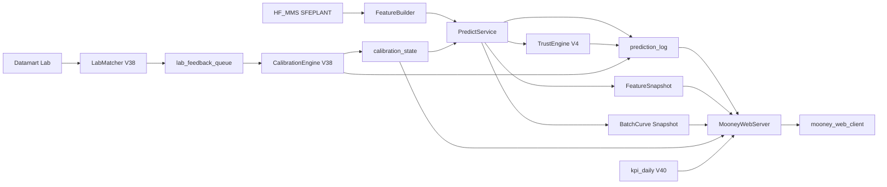

# 门尼系统实施任务书（累积演进总规格）

| 项 | 内容 |
|----|------|
| 文档角色 | **唯一实施真相源**；版本增量只叠加不推倒 |
| 产品版本线 | V3.7（基线）→ V3.8（Lab+校准）→ V4.0（可信度+KPI） |
| 模型产线 | V3.7 `HybridUnifiedMooneyModel` + 生产包 `save_production_v37_model_package.py` |
| 闭环规范 | [production_online_calibration_and_continuous_improvement_plan.md](./production_online_calibration_and_continuous_improvement_plan.md)（英文原文）；工程落地细节见本文 §2–§7 / 附录 D |
| 分版跳转 | [V3.7](./门尼系统实施任务书_V3.7.md) · [V3.8](./门尼系统实施任务书_V3.8.md) · [V4.0](./门尼系统实施任务书_V4.0.md)（均为本文件索引） |
| 日期 | 2026-07-31 |

---

## 0. 文档演进规则与版本矩阵

### 0.0 怎么读这套文档（角色分工）

| 文档 | 角色 | 你该怎么用 |
|------|------|------------|
| **`门尼系统实施任务书.md`（本文）** | **中文契约圣经**：库表、API JSON、公式、代码锚点 | 对字段/接口有争议时以本文为准 |
| **`_V3.7.md` / `_V3.8.md` / `_V4.0.md`** | **本版执行手册** | 开工某版本时打开；细节契约回链本文 |
| **`_总目录.md`** | 入口 | 只指路 |
| **`production_online_..._plan.md`** | **英文闭环规范** | Pipeline/状态机/α/门禁原文；与本文对照，不以它替代 MooneyWeb API 契约 |

**不是**两套平行契约：英文管闭环原则；中文总规格管 MooneyWeb 工程契约；分版手册只写本版怎么干。

### 0.1 演进铁律

1. **升级 = 修订 + 追加**：后一版不得删除或改义前一版已冻结的表列、API 路径、JSON 字段、页面路由。
2. **实施永远读「当前累积契约」**：第 3–6 章是全版本合集；第 7 章只描述相对上一版多了什么、怎么落地。
3. **标注约定**：凡表列 / API / 页面区块均标 `引入` 版本；若后版改写权限或语义，标 `修订` 并写明变更。
4. **禁止一版一个样**：全版本共用第 1–6 章骨架；禁止另起结构完全不同的平行任务书。

### 0.2 版本能力矩阵

| 能力 | V3.7 | V3.8 | V4.0 |
|------|:----:|:----:|:----:|
| Pipeline A 准实时预测写库 | ✓ | ✓ | ✓ |
| 诊断 UI（漏斗/特征/专家/五灯） | ✓ | ✓ | ✓ |
| Pipeline B LabMatcher | | ✓ | ✓ |
| Pipeline C CalibrationEngine（SQL 状态机 EWMA） | | ✓ | ✓ |
| Pipeline D KPI 聚合 | | | ✓ |
| TrustEngine 置信度/区间/原因码 | | | ✓ |
| 详情 `prediction` 节点 | ✓ | ✓ | ✓ |
| 详情 `lab` 节点 | | ✓ | ✓ |
| 详情 `trust` 节点 | | | ✓ |

### 0.3 部署拓扑（全版本共用，永不换壳）

```text
[Windows Server]
  NSSM: MooneyPredictService (Python)     ← V3.7+；V3.8 可同进程加 Lab/Calib Timer 或第二服务
  NSSM: MooneyLabCalibService (可选)      ← V3.8+
  NSSM: MooneyKpiService (可选日更)       ← V4.0+
       │ 只读 HF_MMS → SFEPLANT；V3.8+ 只读 Datamart
       │ 读写 MooneySystem
       ▼
  SQL Server: MooneySystem（独立库，禁止写 MixingCurveData / SFEPLANT）
       ▲ 只读
  IIS: 站点「MooneyWeb」
       ├─ /        → Vue dist (mooney_web_client)
       └─ /api/*   → ASP.NET Core (MooneyWebServer) 或反代 :7254
```

**铁律：** 浏览器只打 IIS / 开发代理；**打开页面绝不同步调用 Python**。

**端口：** API 开发 `7254`；Vue 开发 `5174`；勿与 MixingCurve `7154`/`5173` 冲突。

---

## 1. 代码基线地图（对标本仓库）

### 1.1 生产主链（必须使用）

| 职责 | 路径 | 符号 / 约定 |
|------|------|-------------|
| Stage1+1b+Stage2 | `Mooney_Prediction_Pipeline/model_training/hybrid_unified_model.py` | `HybridUnifiedMooneyModel.predict` → `(uncal, s1, s1b, s2)` |
| Silica 专家子系统 | `.../silica_subsystem.py` | `SilicaSubsystemPredictor` |
| CB 专家子系统 | `.../cb_subsystem.py` | `CarbonBlackSubsystemPredictor` |
| Stage1b 偏置 | `.../bias_shrinkage.py` | `RegularizedBiasEstimator`（k=5.0） |
| 离线 Stage3 参考 | `.../stage3_online_calibration.py` | `Stage3DelayedFeedbackCalibrator`（**仅离线审计**，见附录 D） |
| 生产打包 | `.../save_production_v37_model_package.py` | 产出 `models/v37_production_model_package/{hybrid_model.joblib, stage3_calibrator.joblib, feature_metadata.json, online_inference_api.py}` |
| Stage1 特征 | `feature_engineering/stage1_recipe_features.py` | `extract_stage1_recipe_features` |
| Stage2 特征 | `feature_engineering/stage2_process_features.py` | `extract_stage2_process_features` |
| PID 代理 | `feature_engineering/silica_pid_feature_builder.py` | `build_silica_pid_features` |
| CB 分散代理 | `feature_engineering/cb_dispersion_feature_builder.py` | `build_cb_dispersion_features` |
| 材料聚类 | `feature_engineering/clustering.py` | `cluster_silica_carbon_black` → `Silica` / `CarbonBlack` |
| label_group（训练） | `model_training/label_group_handler.py` | `add_label_group_information` → `_label_group_id`：优先 SampleID；否则 `OrderID\|PalletID`；Pallet 缺失时训练代码回退为 **仅 `OrderID`** |
| label_group（生产约定） | PredictService 组装 | 有托盘：`OrderID\|PalletID`；无托盘：**显式** `OrderID\|NOPALLET\|BatchID`（便于 Matcher 识别并禁止校准；**不是**训练 handler 的字面输出） |
| MMS 生产热路径 | `data_processing/pipeline_orchestrator.py` | `connect_mms_encrypted(database='SFEPLANT')` → credentials 键 **`HF_MMS`**；库 **`SFEPLANT`**（必要时 ARCHIVE 回退，见 orchestrator） |
| MMS 离线/副本（勿当热路径） | `data_processing/function_definitions_M1.py` | `connect_mms` 默认 **`APAC` + `HESFESFEPLANT`**；SQL 亦硬编码该库名 — **生产 FeatureBuilder 禁止直接当准实时源** |
| Datamart Lab | `pipeline_orchestrator.connect_datamart_encrypted` / `function_definitions_M1.connect_datamart` | `mustangmaster`（V3.8+）；部署机用仓库旁 `credentials.json`（orchestrator 路径），勿依赖 M1 里的 home-dataset 路径 |

### 1.2 路由常量（与模型一致）

```text
phase_route:
  oil_wet     if is_oil_loading_present>0 OR Stage4_WetMixing_Duration>0
  no_oil_dry  otherwise

route_key = (material_system, phase_route)
  Silica + use_silica_subsystem     → SilicaSubsystemPredictor
  CarbonBlack + use_cb_subsystem    → CarbonBlackSubsystemPredictor
  else                              → 样本规模决定的 LGBM/Ridge/Huber
```

### 1.3 明确不作为生产热路径

| 代码 | 原因 |
|------|------|
| `train_group_mooney_models_ultimate3stage.py`（Kalman Stage3） | 旧产线 |
| `server_deployment/daily_pipeline_runner.py`（JSON rolling） | 旧日更 |
| `dashboard/serve_dashboard.py` :8050 CSV 回放 | 仅演示，非 MooneyWeb |
| 打包脚本生成的 `online_inference_api.py` 内 `calibrate_time_series(..., target_col=MNY)` | **含当前 Lab 泄漏风险**；上线前必须改成读 SQL `calibration_state`（见 §6.3、§7.1） |

---

## 2. 端到端运行时设计

### 2.1 全链路（累积）



### 2.2 预测公式（全版本）

```text
raw_prediction   = stage1_pred + stage1b_bias + stage2_delta
                   （即 HybridUnifiedMooneyModel.predict 的 uncal）
calibration_offset = bias_offset from calibration_state by scope_key
                     （无行 / V3.7：恒为 0）
final_prediction = raw_prediction + calibration_offset

禁止：当前 batch 的 Lab/MNY 参与当次 final 计算
允许：历史已 CONSUMED 的反馈更新 state，仅服务后续 batch
```

### 2.3 写权限总表

| 数据 | INSERT | UPDATE 允许列 | 永不 UPDATE |
|------|--------|---------------|-------------|
| `prediction_log` 预测列 | Predict | — | stage* / raw / offset / final / expert / pipeline_status（写后） |
| `prediction_log` lab 列 | — | V3.8：lab_* / error / lab_status | — |
| `prediction_log` trust 列 | — | V4.0：confidence_* / interval_* / reason_codes | — |
| `FeatureSnapshot` / `BatchCurve` | Predict | 同车重试可覆盖快照（可选策略：仅失败重试） | — |
| `lab_feedback_queue` | Matcher | Engine：status / reject_reason | raw/final 拷贝列 |
| `calibration_state` | Engine | Engine：bias / α / n / times | — |
| `calibration_event_log` | Engine | — | 追加只读 |
| `kpi_daily` | KpiAggregator | 同日重算可覆盖 | — |

### 2.4 Pipeline 触发节奏

| Pipeline | 引入 | 触发 | 周期建议 | 配置键（建议） |
|----------|------|------|----------|----------------|
| A Predict | V3.7 | 新「曲线就绪」batch | **2s** | `PREDICT_POLL_SECONDS=2` |
| B LabMatcher | V3.8 | 定时 | **300s** | `LAB_MATCH_POLL_SECONDS=300` |
| C CalibrationEngine | V3.8 | queue 有 NEW | 同 Timer 内紧随 Matcher | — |
| D KPI | V4.0 | 日/班 | 每日 1 次 | `KPI_CRON=0 6 * * *` |

### 2.5 MMS ↔ MooneySystem 字段映射（执行锁死）

对齐仓库参考实现：`model_analysis/predict_latest_sfe_order.py`、`predict_order_v3.py`、`pipeline_orchestrator.py`。

| MooneySystem / 任务书 | MMS 来源 | 规则 |
|----------------------|----------|------|
| `order_id` | `Orders.OrderID` | 原样字符串 |
| `batch_id` | `BatchHeader.BatchNumber` | **`str(int(BatchNumber))`**（不加前导零存库；与训练合成键 `OrderID_NNNN` 区分，后者仅内部 fk） |
| `compound_name` | `Orders.CompoundName` | |
| `recipe_code` | `Orders.CompoundDescription` | 可空 |
| `mixer_id` | `Orders.Equipment` | 脚本里常别名 `MixerLine`；**写入列名统一 `mixer_id`** |
| `product_time` | `Orders.OrderStartTime` 或 `BatchHeader.BatchEndTime` | 列表排序优先 `BatchEndTime`，无则 `OrderStartTime` |
| `label_group_id`（有托盘） | `OrderID` + `BatchHeader.PalletID` | `f"{OrderID}\|{PalletID}"`（Pallet 去空白大写，与训练一致） |
| `label_group_id`（无托盘） | — | `f"{OrderID}\|NOPALLET\|{batch_id}"` |
| 曲线 temp/power/… | `BatchCurve.Curve1/2/5/6/7` | 取该 Order+Batch **最新一条** Timestamp 的曲线（`OUTER APPLY TOP 1 … ORDER BY Timestamp DESC`） |
| 配方重量占比 | **`OrderMaterials`** + `BatchHeader.BatchWeight` | 与 `predict_latest_sfe_order` 的 mat_pivot 一致；**不要**误用 `BatchMaterials` 当主路径（M1 离线另用） |

**「车次可预测 / 完成」判定（权威）：**

```text
BatchCurve 对该 (OrderID, BatchNumber) 存在行，且 Curve1 IS NOT NULL AND Curve2 IS NOT NULL
（参考 predict_latest_sfe_order.query_latest_order_rows）
不以 BatchEndTime 作为唯一门槛（M1 离线才常用 EndTime）
可选加强：解码后曲线点数 ≥ 10（与 extract 脚本一致）
```

**胶料过滤（与现网脚本一致，可配置）：** `CompoundName` 匹配 `M1-%` 或 `R1-%`；`OrderID` 不含 `H`。

### 2.6 API / 服务调度谁调谁（端到端）

```text
【写路径 — 浏览器永不参与】
  MooneyPredictService (NSSM, 每 2s)
    → MMS 查询「曲线就绪且 prediction_log 无成功行」
    → FeatureBuilder → predict_online → INSERT MooneySystem
  MooneyLabCalibService (V3.8+, 每 300s)
    → Datamart Lab → Matcher → Engine → UPDATE lab_* / state
  （V4.0 Predict 写后同进程 TrustEngine；Kpi 日更）

【读路径 — 仅 HTTP】
  Vue (轮询)
    每 5s:  GET /api/Health
            GET /api/MooneyBatches/Recent?minutes=240
    进详情: GET /api/MooneyBatches/{orderId}/{batchId}
            并行: .../curve , .../features
            诊断: .../debug（仅 DIAGNOSTIC）
    V3.8+:  .../lab ; ByLabelGroup ; Calibration/States[+events]
    V4.0+:  详情已含 trust；Kpi/Summary + Kpi/Daily（KPI 页）

  ASP.NET 只 SELECT MooneySystem，禁止调 Python、禁止连 MMS 做推理
```

**开发联调顺序：** 先 Swagger 打通读 API（可手工 INSERT 一行假数据）→ 再启 Predict 写真实行 → 最后前端绑字段。

---

## 3. 数据库累积设计（`MooneySystem`）

实施时落盘：`sql/mooney_system_ddl.sql`（V3.7 一次建全表；V4.0 可 ALTER 补列）。

### 3.1 `prediction_log`（每车一行）

| 列 | 类型 | 引入 | 谁写 | 说明 |
|----|------|------|------|------|
| prediction_id | NVARCHAR(64) PK | V3.7 | Predict | `{orderId}_{batchId}_{modelVersion}` |
| prediction_time | DATETIME2 | V3.7 | Predict | |
| order_id, batch_id | NVARCHAR(64) | V3.7 | Predict | |
| label_group_id | NVARCHAR(128) | V3.7 | Predict | 生产约定：有托盘 `OrderID\|PalletID`；无托盘 `OrderID\|NOPALLET\|BatchID`（与训练 handler 回退「仅 OrderID」不同，见 §1.1） |
| compound_name, recipe_code | NVARCHAR | V3.7 | Predict | |
| material_system | NVARCHAR(64) | V3.7 | Predict | `Silica` / `CarbonBlack` |
| phase_route | NVARCHAR(64) | V3.7 | Predict | `oil_wet` / `no_oil_dry` |
| mixer_id | NVARCHAR(64) | V3.7 | Predict | |
| stage1_pred, stage1b_bias, stage2_delta | FLOAT | V3.7 | Predict | **冻结** |
| raw_prediction | FLOAT NOT NULL | V3.7 | Predict | **冻结** |
| calibration_offset | FLOAT | V3.7 | Predict | 写入时快照；**冻结**（后续 state 变也不改历史行） |
| final_prediction | FLOAT NOT NULL | V3.7 | Predict | = raw+offset；**冻结** |
| calibration_state_id | NVARCHAR(64) NULL | V3.7 | Predict | 使用的 state 行；无则 NULL |
| lab_status | NVARCHAR(32) | V3.7 | Predict 初值 `PENDING`；V3.8 Matcher/Engine 推进 | 见 §3.6 |
| lab_actual_mny, lab_result_time | FLOAT / DATETIME2 | V3.8 | Matcher | |
| raw_error, online_error | FLOAT | V3.8 | Matcher | lab−raw；lab−final |
| expert_contributions_json | NVARCHAR(MAX) | V3.7 | Predict | Silica：`predict_experts` → `pid`/`wet`/`bottom`/`material`；CB → `prep`/`bottom`/`material`；非子系统路由 → `{}`。**注意** `HybridUnifiedMooneyModel.predict` 本身不返回该字典，须在 `predict_online` 内按路由额外调用 |
| pipeline_status_json | NVARCHAR(MAX) | V3.7 | Predict | 见 §3.5 |
| predict_duration_ms | INT | V3.7 | Predict | |
| model_version | NVARCHAR(64) | V3.7 | Predict | 如 `V3.7 Production` |
| is_cold_start | BIT | V3.7 | Predict | |
| data_quality_flags | NVARCHAR(256) | V3.7 | Predict | 短标记串，列表展示用 |
| confidence_score | FLOAT | V4.0 | TrustEngine | 0–100 |
| confidence_label | NVARCHAR(16) | V4.0 | TrustEngine | HIGH/MED/LOW |
| confidence_breakdown_json | NVARCHAR(MAX) | V4.0 | TrustEngine | 六维 |
| interval_low, interval_high | FLOAT | V4.0 | TrustEngine | |
| reason_codes | NVARCHAR(MAX) | V4.0 | TrustEngine | JSON 数组 |
| spec_risk_label | NVARCHAR(16) NULL | V4.0 | TrustEngine | 可选 |

索引建议：`(prediction_time DESC)`、`(order_id, batch_id)`、`(lab_status, prediction_time)`、`(label_group_id)`、`(compound_name, mixer_id)`。

### 3.2 `FeatureSnapshot`

| 列 | 引入 | 说明 |
|----|------|------|
| order_id, batch_id | V3.7 PK | |
| features_json | V3.7 | 全特征字典 |
| filled_keys_json | V3.7 | 缺失后按 0.0 填入的键列表（与打包 stub / 训练 `fillna(0.0)` 对齐；**默认不用中位数**，除非另存训练统计并配置开启） |
| completeness_ratio | V3.7 | 0–1 |
| updated_at | V3.7 | |

### 3.3 `BatchSnapshot` / `BatchCurve` / `HeartBeat`

| 表 | 引入 | 用途 |
|----|------|------|
| BatchSnapshot | V3.7 | 列表冗余：胶料、product_time、mixer、flags、material_system… |
| BatchCurve | V3.7 | 通道数组或点表；供 `/curve` |
| HeartBeat | V3.7 | `ServiceName`、`LastBeatUtc`、`Detail`；Predict（及 LabCalib）各一行 |

### 3.4 闭环表

#### `lab_feedback_queue`（V3.7 建空壳；V3.8 写业务）

| 列 | 引入写 | 说明 |
|----|--------|------|
| feedback_id | V3.8 | PK GUID |
| prediction_id | V3.8 | 组内代表行 |
| label_group_id, order_id, batch_id, compound_name | V3.8 | |
| lab_actual_mny, lab_result_time | V3.8 | |
| matched_time | V3.8 | |
| match_quality | V3.8 | 0–1 |
| raw_prediction, final_prediction | V3.8 | **自 log 冻结列拷贝** |
| raw_error, online_error | V3.8 | |
| feedback_status | V3.8 | `NEW`→`CONSUMED`/`REJECTED`/`SKIPPED_DUP` |
| reject_reason | V3.8 | 可空 |

**组去重：** 同 `label_group_id` 已有 `CONSUMED` → 不再插校准用 `NEW`。

#### `calibration_state`（V3.7 空壳；V3.8 Engine 写）

| 列 | 说明 |
|----|------|
| calibration_state_id | PK |
| scope_type | 默认 `COMPOUND_MIXER` |
| scope_key | `CompoundName\|MixerId`（UNIQUE） |
| material_system | |
| bias_offset | EWMA；Predict 读作 offset |
| bias_std | 可选，区间用 |
| n_feedback | |
| alpha_current | 上次 α |
| last_feedback_time, last_update_time | |
| state_quality / status | ACTIVE / STALE 等 |

#### `calibration_event_log`（追加只读）

| 列 | 说明 |
|----|------|
| event_id, calibration_state_id, feedback_id | |
| previous_bias_offset, new_bias_offset, raw_error, alpha_used | |
| change_point_detected | BIT |
| update_reason, update_time | |

#### `kpi_daily`（V4.0）

| 列 | 说明 |
|----|------|
| kpi_date, material_system | PK `(date, system)`；system=`ALL`/`Silica`/`CarbonBlack` |
| n_pred, n_with_lab | |
| raw_mae, online_mae | |
| low_conf_rate | |
| lab_delay_hours_p50 | |
| high_fill_rate | |
| reject_count, write_fail_count | |

### 3.5 `pipeline_status_json`（V3.7 冻结形状）

```json
{
  "mms": {"ok": true, "ms": 120, "error": null},
  "feature": {"ok": true, "completeness": 0.92, "n_filled": 3},
  "route": {"ok": true, "material_system": "Silica", "phase_route": "oil_wet"},
  "predict": {"ok": true, "ms": 45},
  "write": {"ok": true, "ms": 30}
}
```

任一步 `ok:false` → 对应前端灯红。

### 3.6 `lab_status` 状态机（V3.8；V3.7 仅 PENDING）

```text
PENDING → MATCHED → VALIDATED → CONSUMED
                 ↘ REJECTED
```

与闭环规范映射：`PREDICTED_PENDING_LAB`≈PENDING；`LAB_MATCHED_NEW`≈MATCHED；`FEEDBACK_VALIDATED`≈VALIDATED；`CALIBRATION_UPDATED`≈CONSUMED；`FEEDBACK_REJECTED`≈REJECTED。

---

## 4. HTTP API 累积契约

约定：ASP.NET Core；JSON **camelCase**；`200` 成功；`404` 无车次；`500` `{ "message" }`。  
CORS 开发 AllowAll。Swagger：`http://localhost:7254/swagger`。

### 4.1 端点总表

| 方法路径 | 引入 | 读表 |
|----------|------|------|
| `GET /api/Health` | V3.7 | HeartBeat + Models |
| `GET /api/Models/Active` | V3.7 | 配置/注册表 |
| `GET /api/MooneyBatches/Recent?minutes=` | V3.7；字段 V3.8/V4.0 追加 | Snapshot + log |
| `GET /api/MooneyBatches/{orderId}/{batchId}` | V3.7；节点 `lab` V3.8、`trust` V4.0 | log + 关联 |
| `GET /api/MooneyBatches/{o}/{b}/curve` | V3.7 | BatchCurve |
| `GET /api/MooneyBatches/{o}/{b}/features` | V3.7 | FeatureSnapshot |
| `GET /api/MooneyBatches/{o}/{b}/debug` | V3.7 | 聚合 |
| `GET /api/MooneyBatches/{o}/{b}/lab` | V3.8 | log + queue |
| `GET /api/MooneyBatches/ByLabelGroup/{labelGroupId}` | V3.8 | log |
| `GET /api/Calibration/States` | V3.8 | calibration_state |
| `GET /api/Calibration/States/{id}/events` | V3.8 | event_log |
| `GET /api/Kpi/Summary?days=` | V4.0 | kpi_daily |
| `GET /api/Kpi/Daily?from=&to=&materialSystem=` | V4.0 | kpi_daily |

### 4.2 V3.7 响应形状（冻结）

#### `GET /api/Health`

```json
{
  "apiOk": true,
  "dbOk": true,
  "predictHeartbeatUtc": "2026-07-31T10:00:00Z",
  "predictAgeSeconds": 3,
  "activeModelVersion": "V3.7 Production"
}
```

前端：`predictAgeSeconds > 30` → 心跳红。

#### `GET /api/MooneyBatches/Recent?minutes=240`

```json
{
  "items": [{
    "orderId": "...", "batchId": "...", "productTime": "...",
    "compoundName": "...", "mixerId": "...",
    "materialSystem": "Silica", "phaseRoute": "oil_wet",
    "stage1Pred": 52.1, "stage1bBias": 1.2, "stage2Delta": 1.5,
    "rawPrediction": 54.8, "calibrationOffset": 0.0, "finalPrediction": 54.8,
    "labStatus": "PENDING", "isColdStart": false,
    "dataQualityFlags": "", "modelVersion": "V3.7 Production",
    "labActualMny": null, "rawError": null, "onlineError": null,
    "confidenceScore": null, "confidenceLabel": null
  }]
}
```

> `lab*` / `confidence*`：V3.7 可恒为 null；V3.8/V4.0 填充。**不得删键**（前端按 null 隐藏列即可）。

#### `GET /api/MooneyBatches/{orderId}/{batchId}`

```json
{
  "meta": {
    "orderId": "", "batchId": "", "labelGroupId": "",
    "compoundName": "", "recipeCode": "",
    "materialSystem": "", "phaseRoute": "", "mixerId": "",
    "productTime": "", "modelVersion": "", "isColdStart": false
  },
  "prediction": {
    "stage1Pred": 0, "stage1bBias": 0, "stage2Delta": 0,
    "rawPrediction": 0, "calibrationOffset": 0, "finalPrediction": 0,
    "calibrationStateId": null, "labStatus": "PENDING",
    "expertContributions": { "pid": 1.2, "wet": -0.3 },
    "pipelineStatus": {},
    "predictDurationMs": 45
  },
  "lab": null,
  "trust": null
}
```

- V3.8：`lab` 填对象（与 `/lab` 同形，可内嵌）。
- V4.0：`trust` 填对象（见 §4.4）。

#### `GET .../curve`

```json
{ "channels": { "temp": [], "power": [], "ram": [] }, "xType": "index" }
```

#### `GET .../features`

```json
{
  "completenessRatio": 0.92,
  "items": [
    { "name": "weight_pct_silica", "value": 12.3, "filled": false, "group": "s1" },
    { "name": "env_temp_mean", "value": 25.0, "filled": true, "group": "env" }
  ]
}
```

#### `GET .../debug`

`meta + prediction + lab + trust + features + curveMeta`（测试开；生产可关/鉴权）。

#### `GET /api/Models/Active`

```json
{ "modelVersion": "V3.7 Production", "packagePath": "..." }
```

### 4.3 V3.8 追加响应

#### `GET .../lab`

```json
{
  "labStatus": "CONSUMED",
  "labActualMny": 56.2,
  "labResultTime": "...",
  "rawError": 1.4,
  "onlineError": 1.4,
  "feedbackId": "...",
  "feedbackStatus": "CONSUMED",
  "rejectReason": null,
  "matchQuality": 0.95,
  "labelGroupId": "2325066|001",
  "stateMachine": ["PENDING", "MATCHED", "VALIDATED", "CONSUMED"]
}
```

#### `GET /api/MooneyBatches/ByLabelGroup/{labelGroupId}`

```json
{
  "labelGroupId": "",
  "labActualMny": 56.2,
  "batches": [
    { "orderId": "", "batchId": "", "finalPrediction": 0, "triggeredCalibration": true }
  ]
}
```

#### `GET /api/Calibration/States?materialSystem=&q=`

```json
{
  "items": [{
    "calibrationStateId": "", "scopeType": "COMPOUND_MIXER", "scopeKey": "",
    "biasOffset": 0.4, "alphaCurrent": 0.25, "nFeedback": 3,
    "lastUpdateTime": "", "status": "ACTIVE"
  }]
}
```

#### `GET /api/Calibration/States/{id}/events`

```json
{
  "events": [{
    "eventId": "", "previousBiasOffset": 0.2, "newBiasOffset": 0.4,
    "rawError": 1.5, "alphaUsed": 0.6, "changePointDetected": true,
    "updateReason": "", "updateTime": ""
  }]
}
```

### 4.4 V4.0 追加响应

详情 `trust`（**固定读此节点**）：

```json
"trust": {
  "confidenceScore": 88,
  "confidenceLabel": "HIGH",
  "breakdown": {
    "featureCompleteness": 90,
    "calibrationHealth": 70,
    "recentGroupMae": 80,
    "oodScore": 85,
    "labFeedbackAge": 60,
    "dataQuality": 95
  },
  "intervalLow": 57.1,
  "intervalHigh": 59.3,
  "reasonCodes": [
    { "rank": 1, "expertKey": "pid", "contribution": 1.2, "text": "PID段贡献 +1.2 MU" }
  ],
  "specRiskLabel": "LOW",
  "calibrationSummary": { "biasOffset": 0.4, "status": "ACTIVE" }
}
```

#### `GET /api/Kpi/Summary?days=7`

```json
{
  "days": 7,
  "overall": {
    "rawMae": 2.1, "onlineMae": 1.8,
    "lowConfRate": 0.12, "labDelayP50Hours": 4.5
  },
  "byMaterial": [{ "materialSystem": "Silica", "rawMae": 2.0 }]
}
```

#### `GET /api/Kpi/Daily?...`

```json
{
  "points": [
    { "date": "2026-07-01", "rawMae": 2.2, "onlineMae": 1.9, "nWithLab": 10 }
  ]
}
```

### 4.5 前端 API 绑定总表（锁死）

| 页面区块 | API | JSON 路径 | 引入 |
|----------|-----|-----------|------|
| 顶栏心跳 | Health | `predictAgeSeconds` | V3.7 |
| 监控列表 | Recent | `items[]` | V3.7 |
| 列表 Lab 列 | Recent | `labStatus/labActualMny/*Error` | V3.8 |
| 列表置信度 | Recent | `confidenceScore/Label` | V4.0 |
| 流水线五灯 | Batches/{o}/{b} | `prediction.pipelineStatus` | V3.7 |
| 预测漏斗 | 同上 | `prediction.stage*/raw/offset/final` | V3.7 |
| 专家条 | 同上 | `prediction.expertContributions` | V3.7 |
| 曲线 | .../curve | `channels` | V3.7 |
| 特征 Tab | .../features | `items` | V3.7 |
| JSON Tab | .../debug | 整包 | V3.7 |
| Lab 卡/状态机 | .../lab 或 `.lab` | 全对象 | V3.8 |
| 组内车次 | ByLabelGroup | `batches` | V3.8 |
| 校准页表 | Calibration/States | `items` | V3.8 |
| 校准时间线 | .../events | `events` | V3.8 |
| 可信度顶卡 | 详情 `.trust` | 全对象 | V4.0 |
| KPI 卡片 | Kpi/Summary | `overall` | V4.0 |
| KPI 趋势 | Kpi/Daily | `points` | V4.0 |

---

## 5. 前端累积设计（`mooney_web_client`）

技术：Vue3 + Vite + vue-router + Axios + Arco Design Vue + ECharts。  
环境变量：

```text
VITE_API_BASE_URL=/api
VITE_API_PROXY_TARGET=http://localhost:7254
VITE_DIAGNOSTIC_MODE=true
VITE_HAS_LAB_MODULE=false   # V3.8 起 true
VITE_HAS_TRUST_MODULE=false # V4.0 起 true
```

### 5.1 路由树（生长，不换名）

| 路由 | 引入 | 必备区块 |
|------|------|----------|
| `/mooney-monitor` | V3.7 | 心跳；筛选；表列 S1/S1b/S2/raw/offset/final/flags/route；V3.8+ Lab 列；V4.0+ 置信度 |
| `/mooney-batch/:orderId/:batchId` | V3.7 | 五灯；曲线；漏斗；专家；Tab 特征/JSON/日志；V3.8+ Lab 卡+状态机+组表；V4.0+ trust 顶卡（**不删**诊断区） |
| `/mooney-health` | V3.7 | HeartBeat、今日写入、最近失败 |
| `/mooney-calibration` | V3.8 | States 表 + 选中行 events |
| `/mooney-kpi` | V4.0 | Summary 卡 + Daily 趋势；Silica/CB 拆分 |

列表默认 **5s** 轮询 Health + Recent。

### 5.2 诊断页必须能回答（V3.7 起，后版保留）

| # | 问题 | UI 位置 |
|---|------|---------|
| 1 | MMS 是否取到？ | 灯 · MMS |
| 2 | 填充是否过多？ | 特征 Tab |
| 3 | Silica 还是 CB？ | route 灯 + 标签 |
| 4 | S1/1b/S2？ | 漏斗 |
| 5 | 专家贡献？ | 专家条 |
| 6 | final=raw+offset？ | 漏斗校验行 \|Δ\|&lt;1e-3 |
| 7 | 服务活着？ | 顶栏心跳 |
| 8 | Lab/校准？（V3.8） | Lab 卡 + 校准页 |
| 9 | 可信度？（V4.0） | trust 顶卡 |

### 5.3 组件演进原则

- 同一 `BatchDetailView` 内用 feature flag 挂载 `LabPanel` / `TrustCard`，**不新建平行详情页**。
- 列表列用配置数组追加，禁止为 V3.8 复制整页 Monitor。

---

## 6. Python 服务模块设计

落盘建议根：`services/mooney_predict_service/`（及可选 `mooney_lab_calib_service/`）。

### 6.1 模块与职责

| 模块 | 引入 | 输入 | 输出 | 禁止 |
|------|------|------|------|------|
| `feature_builder.py` | V3.7 | Order/Batch + MMS | 特征行 + filled_keys + completeness | 写 Lab 进特征当目标 |
| `predict_online.py` | V3.7 | 特征行 + joblib + state | s1/s1b/s2/raw/offset/final/experts | 调 `calibrate_time_series` 喂当前 MNY |
| `writer.py` | V3.7 | 上项结果 | INSERT log/snapshot/curve | UPDATE 冻结列 |
| `heartbeat.py` | V3.7 | — | HeartBeat upsert | |
| `predict_service_main.py` | V3.7 | 配置 | 2s 循环 | 对浏览器开 HTTP |
| `lab_source_datamart.py` | V3.8 | 时间窗 | Lab 行 | |
| `lab_matcher.py` | V3.8 | Lab + PENDING log | queue + 回填 lab 列 | 改 raw/final |
| `calibration_engine.py` | V3.8 | queue NEW + α 配置 | state + event + status | 改历史 final；NOPALLET 更新 state |
| `trust_engine.py` | V4.0 | log+features+state | UPDATE trust 列 | 改 raw/final |
| `kpi_aggregator.py` | V4.0 | log/queue | kpi_daily | |

### 6.2 FeatureBuilder 逻辑

1. 使用 **`pipeline_orchestrator.connect_mms_encrypted('SFEPLANT')`**（credentials 键 `HF_MMS`）。禁止默认调用 `function_definitions_M1.connect_mms()`（APAC 副本）。开发机若无加密封装，可对齐 `predict_latest_sfe_order.connect_mms`（同为 `HF_MMS`/`SFEPLANT`）。
2. **发现候选车**（伪 SQL，实现可落 `sql/poll_ready_batches.sql`）：

```sql
-- 近 lookback 内、曲线就绪、尚未成功预测
SELECT o.OrderID, bh.BatchNumber, o.CompoundName, o.CompoundDescription,
       o.Equipment AS MixerLine, o.OrderStartTime, bh.BatchEndTime, bh.PalletID
FROM dbo.Orders o
JOIN dbo.BatchHeader bh ON o.OrderID = bh.OrderID
OUTER APPLY (
  SELECT TOP 1 Curve1, Curve2, Curve5, Curve6, Curve7, Timestamp
  FROM dbo.BatchCurve bc
  WHERE bc.OrderID = o.OrderID AND bc.BatchNumber = bh.BatchNumber
  ORDER BY bc.Timestamp DESC
) bc
WHERE bc.Curve1 IS NOT NULL AND bc.Curve2 IS NOT NULL
  AND (o.CompoundName LIKE 'M1-%' OR o.CompoundName LIKE 'R1-%')
  AND o.OrderID NOT LIKE '%H%'
  AND o.OrderStartTime >= DATEADD(hour, -@LookbackHours, GETDATE())  -- 默认 24
  -- 应用层再过滤：MooneySystem.prediction_log 无 (order_id, batch_id) 成功行
```

3. 拉曲线通道 + **`OrderMaterials` 重量 pivot**（复制 `predict_latest_sfe_order` mat_pivot 模式）；需要时再拉 ARCHIVE。
4. `build_silica_pid_features` + `build_cb_dispersion_features`（与打包脚本一致）。
5. `cluster_silica_carbon_black` → `material_system`。
6. 对齐 `feature_metadata.json`；缺列/缺值 → **`0.0`**，记入 `filled_keys`。
7. 组装生产 `label_group_id`、`phase_route`、`mixer_id=Equipment`、`batch_id=str(BatchNumber)`（§2.5）。

### 6.3 predict_online 逻辑（修正打包 stub）

```text
# model.predict 返回四元组（均未含线上 Stage3）：
#   (uncal = s1+s1b+s2, s1, s1b, s2)
uncal, s1, s1b, s2 = model.predict(batch_df, cluster_col="material_system")
raw = float(uncal[0])   # 单车

# 专家贡献：predict() 不返回；必须走私有变换（与 hybrid_unified_model 内部一致）
X_s2_delta, route = model._transform_process_deltas(batch_df, "material_system")
route_key = route.iloc[0]
experts = {}
route_expert = model.stage2_experts_.get(route_key)
if isinstance(route_expert, SilicaSubsystemPredictor):
    pe = route_expert.predict_experts(X_s2_delta.loc[[batch_df.index[0]]])
    experts = {k: float(np.asarray(v).ravel()[0]) for k, v in pe.items()}
    # keys: pid, wet, bottom, material
elif isinstance(route_expert, CarbonBlackSubsystemPredictor):
    pe = route_expert.predict_experts(X_s2_delta.loc[[batch_df.index[0]]])
    experts = {k: float(np.asarray(v).ravel()[0]) for k, v in pe.items()}
    # keys: prep, bottom, material

scope_key = f"{compound_name}|{mixer_id}"
state = SELECT ... WHERE scope_key=@scope AND status='ACTIVE'
offset = clip(state.bias_offset if state else 0.0, -4.0, 4.0)
final = raw + offset
# 禁止: calibrate_time_series(..., 当前行 MNY)
```

实施建议：后续可在 `HybridUnifiedMooneyModel` 增加公开方法 `predict_with_experts()`，避免长期依赖 `_transform_process_deltas`；V3.7 允许先调用私有方法，与现有审计脚本一致。

### 6.4 Predict 主循环（每 2s，配置 `PREDICT_POLL_SECONDS`）

```text
1. heartbeat upsert（ServiceName=MooneyPredictService）
2. 执行 §6.2 候选查询（LookbackHours 默认 24）
3. 对每条候选：若 prediction_log 已有成功行 → skip
4. FeatureBuilder 单车 → pipeline_status.feature
5. predict_online → pipeline_status.predict
6. 事务 INSERT: prediction_log + FeatureSnapshot + BatchSnapshot + BatchCurve
   - prediction_id = f"{order_id}_{batch_id}_{model_version}"
   - lab_status='PENDING'；V3.7 offset 通常 0
7. V4.0: TrustEngine → UPDATE 仅 trust 列（失败不回滚 final）
8. 任一步失败: 记日志；能写则写红灯 pipeline_status；循环不退出
9. sleep PREDICT_POLL_SECONDS
```

### 6.5 LabMatcher（V3.8，~300s）

```text
1. 拉新 Lab（order/pallet/mny/time）
2. 拼 label_group_id；找同组 PENDING（或未 CONSUMED）log
3. 若组已 CONSUMED → skip 或 SKIPPED_DUP
4. 若含 NOPALLET → 可 MATCHED 展示，feedback 标 REJECTED/NOPALLET_NO_CALIB，不进 Engine 校准
5. INSERT queue NEW；UPDATE log lab_* + lab_status=MATCHED + errors
```

### 6.6 CalibrationEngine（V3.8）

配置文件 `calibration_alpha.json`：

```json
{
  "change_point": 0.60,
  "low_volume": 0.40,
  "default": 0.25,
  "high_volume": 0.15,
  "reject": 0.00,
  "change_point_delta_abs": 2.0,
  "max_offset_abs": 4.0
}
```

```text
1. 取 feedback_status=NEW 且非 NOPALLET
2. 质量失败 → REJECTED + reject_reason；log=REJECTED；return
3. log=VALIDATED
4. 取/建 calibration_state by scope_key
5. 选 α（变点 |Δe|≥2.0 → 0.60；低频/默认/高频表）
6. new_bias = (1-α)*old + α*raw_error；clip ±4
7. UPDATE state；INSERT event_log
8. queue=CONSUMED；log=CONSUMED
法则: 同 label_group 只产生一次有效校准更新
```

### 6.7 TrustEngine（V4.0）

六维（缺数据 → 该维 null，合成时跳过并重归一化权重）：

| 维 | 输入 | 规则 |
|----|------|------|
| featureCompleteness | completeness_ratio | ×100 |
| calibrationHealth | n_feedback、龄期 | 无 state→null；过期降分 |
| recentGroupMae | 近 30 天同 scope online_mae | mae 小分高 |
| oodScore | 关键特征 z 最大绝对值 | 离群分低 |
| labFeedbackAge | last_feedback_time | 近则高；无 V3.8→null |
| dataQuality | filled 数、flags | 填充多则低 |

合成 → `trust_weights.json` 加权；≥80 HIGH；≥60 MED；否则 LOW。  
区间：`final ± 1.96σ`（优先同 scope 残差 σ，否则默认 σ）。  
原因码：`expert_contributions` Top3 + 可选 calibration 条。

### 6.8 工具链（运维）

| 工具 | 用途 |
|------|------|
| Python 3.x + 仓库依赖 | 推理/匹配 |
| NSSM | 托管服务 |
| SQL Server | MooneySystem |
| .NET 8 + Hosting Bundle | MooneyWebServer |
| IIS | 静态 + /api |
| Node 18+ | 前端构建 |
| `credentials.json` | MMS/Datamart；勿把 APAC 副本当热路径 |

---

## 7. 版本实施层

### 7.1 V3.7 基线（全量落地）

#### 7.1.1 相对「空仓库」变更清单

| 层 | 内容 |
|----|------|
| 表 | 建全库含闭环空壳；写 prediction_log 预测列 + Snapshot/Curve/HeartBeat |
| API | §4.2 全部 GET；`lab`/`trust` 返回 null |
| UI | monitor / batch / health + 诊断 |
| 服务 | FeatureBuilder + PredictService + 修正后的 predict_online |

#### 7.1.2 最终效果

- 新车次秒级出现在监控列表；详情可查漏斗/特征/曲线/五灯。
- `lab_status=PENDING`；offset 通常为 0。
- Network 无 Python 端口请求。

#### 7.1.3 逐步执行

**步骤 1 — DDL**

```sql
-- 创建数据库 MooneySystem
-- 执行 sql/mooney_system_ddl.sql（含 §3 全部表；闭环三表可为空）
```

验收：SSMS 可见核心表 + 3 张闭环空壳。

**步骤 2 — 导出并修正模型包**

```powershell
cd Mooney_Prediction_Pipeline\model_training
python save_production_v37_model_package.py
```

然后改生产入口：`final = raw + SQL offset`；删除/禁用对当前行 MNY 的 `calibrate_time_series`。

验收：存在 `hybrid_model.joblib`、`feature_metadata.json`；无 Lab 列也能出 raw。

**步骤 3 — FeatureBuilder**

实现 §6.2；对已知 Order/Batch 打出特征，列名 ⊆ metadata。

**步骤 4 — PredictService + NSSM**

实现 §6.4；

```powershell
nssm install MooneyPredictService "C:\Path\python.exe"
nssm set MooneyPredictService AppDirectory "<repo>\services\mooney_predict_service"
nssm set MooneyPredictService AppParameters "predict_service_main.py"
nssm start MooneyPredictService
```

验收：新车有 log；HeartBeat 刷新；`|final-(raw+offset)|<1e-3`。

**步骤 5 — MooneyWebServer**

```powershell
dotnet run   # :7254；实现 §4.2
```

验收：Swagger Recent/详情/features 有数。

**步骤 6 — Vue**

```powershell
# Vite Vue；proxy → 7254；VITE_DIAGNOSTIC_MODE=true；dev :5174
```

验收：§5.2 问题 1–7 可答。

**步骤 7 — IIS**

```powershell
dotnet publish MooneyWebServer -c Release -o .\publish
cd mooney_web_client; npm ci; npm run build
# 根=dist；/api → API；URL Rewrite 防刷新 404
```

验收：内网打开监控；停 NSSM 心跳红、启绿；未写 MixingCurveData/SFEPLANT。

#### 7.1.4 V3.7 验收清单

1. prediction_log 有行且 `PENDING`
2. 漏斗齐全且恒等式成立
3. `/features` 非空或明确空因
4. 心跳随 NSSM 变色
5. Network 无 Python
6. IIS/本机前端+Swagger 通
7. 未污染外部业务库

#### 7.1.5 交给 V3.8 的挂钩

| 挂钩 | 约定 |
|------|------|
| `lab_status=PENDING` | Matcher 扫描 |
| `label_group_id` | 组去重 |
| 冻结 raw/final | 算 error |
| 空 `calibration_state` | Engine 写入；Predict 已会读 |
| `/api/MooneyBatches*` | 只追加 |

---

### 7.2 V3.8 增量（在 V3.7 上叠加）

#### 7.2.1 相对 V3.7 变更清单

| 层 | 变更 |
|----|------|
| 表 | 写 queue/state/event；UPDATE log 的 lab_* / error / status |
| API | 追加 `/lab`、`ByLabelGroup`、`Calibration/*`；Recent 填 lab 字段；详情 `.lab` |
| UI | Lab 列/卡/状态机；`/mooney-calibration`；`VITE_HAS_LAB_MODULE=true` |
| 服务 | LabMatcher + CalibrationEngine + α 配置 |

**不改：** 历史 raw/final；V3.7 API 旧字段语义；诊断 Tab。

#### 7.2.2 调用链

```text
V3.7: MMS→Predict→prediction_log(PENDING, final冻结)
  → Datamart→Matcher→queue(NEW)+log lab 回填
  → Engine→state+event+CONSUMED
  → 下一车 Predict 读 bias_offset→新 final
  → Vue 只读 /lab + /calibration
```

#### 7.2.3 逐步执行

0. V3.7 §7.1.4 全过；Datamart 可查样例 Lab；空壳表存在  
1. `lab_source_datamart.py` — 打印最近 5 条 Lab  
2. LabMatcher 只写 queue — 见 MATCHED；state 未变  
3. CalibrationEngine — event 有行；下一车 offset 变化  
4. NSSM 第二服务或同进程第二 Timer  
5. API §4.3  
6. 前端 Lab + calibration 页  
7. 端到端剧本：MATCHED→CONSUMED→新车 offset；旧 final 不变；同组只 1 次 event；NOPALLET 不更新 state；脏 Lab REJECTED  

#### 7.2.4 V3.8 验收 + 回归

**本版：**

1. Datamart 可匹配 Lab 后，配置周期内（默认 ≤5min）queue 出现 NEW 并进入 CONSUMED 或 REJECTED  
2. 同 `OrderID|PalletID` 多车：有效 `calibration_event_log` **仅 1 次**（或明确 SKIPPED_DUP）  
3. 匹配前后历史行 `final_prediction` 不变  
4. 同 scope 下一新车：`calibration_offset` 等于更新后 `bias_offset`（浮点容差内）  
5. 脏 Lab → REJECTED + reject_reason，state 不变  
6. `NOPALLET` 组：可展示 Lab，**不**更新 state  
7. V3.7 诊断 Tab / API 旧字段仍可用  

**回归：** V3.7 §7.1.4 全部仍通过。

#### 7.2.5 交给 V4.0 的挂钩

`online_error`/`raw_error`、`n_feedback`/`last_feedback_time`、`lab_status`、reject 率 → Trust/KPI 输入。

---

### 7.3 V4.0 增量（在 V3.8 上叠加）

#### 7.3.1 相对 V3.8 变更清单

| 层 | 变更 |
|----|------|
| 表 | 填/ALTER trust 列；建 `kpi_daily` |
| API | 详情 `.trust`；Recent 置信度；`/api/Kpi/*` |
| UI | Trust 顶卡；列表置信度；`/mooney-kpi`；`VITE_HAS_TRUST_MODULE=true` |
| 服务 | TrustEngine（Predict 后）；KpiAggregator（日更） |

**不改：** V3.7/V3.8 冻结列与路径；无 Lab 时校准维 null 仍出分。

#### 7.3.2 Trust 写库顺序

```text
INSERT log（含冻结预测列）
  → TrustEngine.compute
  → UPDATE 仅 confidence_*/interval_*/reason_codes
禁止改 raw/final
```

#### 7.3.3 逐步执行

0. V3.7 必过；V3.8 建议过（否则校准/Lab 维 n/a）  
1. DDL ALTER + `kpi_daily`  
2. TrustEngine 单测  
3. 接入 PredictService  
4. 可选历史回填 Job  
5. API `.trust` + Kpi  
6. 前端顶卡 + 列表  
7. KpiAggregator + `/mooney-kpi`  
8. 验收  

#### 7.3.4 V4.0 验收 + 回归

1. 有专家 ≥1 reason；无则「贡献不足」不崩  
2. 无 V3.8 时校准维 n/a，总分仍可出  
3. `interval_low ≤ final ≤ interval_high`  
4. KPI 样本&lt;5 显示「样本不足」  
5. Network 仍无 Python  
6. **回归** V3.7 §7.1.4 + V3.8 关键验收  

#### 7.3.5 V4.0+ 重训门禁（摘要）

| 步 | 动作 |
|----|------|
| 1 | 全历史 fit → candidate joblib |
| 2 | 五道门禁报告（无当前 Lab 泄漏；label_group 不重复校准；时间外推不退化；冷启动 MAE&lt;3；online_error≤raw_error 仿真） |
| 3 | **人工** Activate |
| 4 | Predict 热加载；新 `model_version` |
| 5 | 可选 `/mooney-models` 页 |

---

## 8. 跨版本验收矩阵

| 检查项 | V3.7 | V3.8 | V4.0 |
|--------|:----:|:----:|:----:|
| 预测写入 + 心跳 | 必 | 回 | 回 |
| 诊断漏斗/特征/五灯 | 必 | 回 | 回 |
| 浏览器不调 Python | 必 | 回 | 回 |
| Lab 匹配 + 组去重 1 次 | | 必 | 回 |
| 历史 final 不可变 | | 必 | 回 |
| NOPALLET 不更新 state | | 必 | 回 |
| 新车读到新 offset | | 必 | 回 |
| trust 节点 + 区间 | | | 必 |
| KPI Summary/Daily | | | 必 |
| 旧 API 字段兼容 | — | 必 | 必 |

---

## 附录 A — 字段追溯表（摘要）

| 字段族 | 引入 | 首次写入者 |
|--------|------|------------|
| stage/raw/offset/final/experts/pipeline | V3.7 | Predict |
| lab_*/error/lab_status 推进 | V3.8 | Matcher/Engine |
| confidence/interval/reason | V4.0 | TrustEngine |

完整列定义见 §3.1。

## 附录 B — API 追溯表

见 §4.1；新增只能在表尾追加行。

## 附录 C — 页面追溯表

见 §5.1；新路由只追加，旧路由只增区块。

## 附录 D — 与闭环规范 / 离线代码差异决议

| 议题 | 决议 |
|------|------|
| 线上 Stage3 | **SQL `calibration_state` + CalibrationEngine**；α 用闭环文档表（0.60/0.40/0.25/0.15） |
| 离线 `Stage3DelayedFeedbackCalibrator` | α 实现为 0.65/0.20 + `lag_k=3`；**仅**离线审计/回放，**不**驱动生产 SQL 状态机 |
| 打包 stub `online_inference_api.py` | 当前会调用 `calibrate_time_series(..., target_col="MNY")` → **有当前 Lab 泄漏风险**；上线前必须改为读 SQL offset |
| 缺特征填充 | 与打包/训练一致默认 **0.0**，不是中位数 |
| MMS 连接 | 生产 = `connect_mms_encrypted`/`HF_MMS`/`SFEPLANT`；**不是** `connect_mms`/`APAC`/`HESFESFEPLANT` |
| label_group | 生产 NOPALLET 显式键；训练 handler 无 Pallet 时仅 OrderID — 实施时以生产约定写 log |
| clip | `max_offset_abs=4.0`（与离线 calibrator 一致） |
| 库隔离 | 仅 `MooneySystem`；不写 MixingCurveData / 不写回 SFEPLANT |
| 页面加载 | 只读 SQL API；不触发推理 |

---

## 附录 E — 交付物总清单（累积）

| 交付物 | 引入 |
|--------|------|
| `sql/mooney_system_ddl.sql` | V3.7（V4.0 ALTER/kpi） |
| `services/mooney_predict_service/` | V3.7 |
| `models/v37_production_model_package/`（修正推理） | V3.7 |
| `MooneyWebServer/` | V3.7 |
| `mooney_web_client/` | V3.7 |
| LabMatcher + CalibrationEngine + `calibration_alpha.json` | V3.8 |
| `trust_engine.py` + `trust_weights.json` | V4.0 |
| `kpi_aggregator.py` | V4.0 |
| 本文件验收勾选记录 | 各版 |

---

**使用方式：** 实施与 Code Review 一律以本文为准；分版 md 仅为章节跳转与增量索引。
