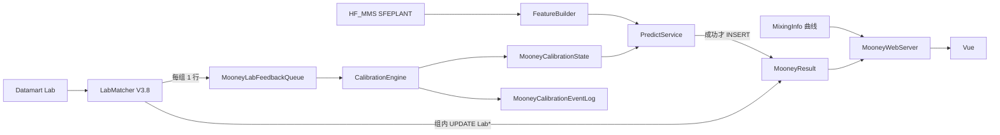

# 门尼系统实施任务书（累积演进总规格）

| 项 | 内容 |
|----|------|
| 文档角色 | **唯一实施真相源**；版本增量只叠加不推倒 |
| 产品版本线 | V3.7（基线预测+监控）→ V3.8（Lab+在线校准）→ V4.0（可信度+KPI） |
| 模型产线 | V3.7 `HybridUnifiedMooneyModel` + `save_production_v37_model_package.py` |
| 结果库 | **与 MixingCurve 同库** `MixingCurveData`（五张 Mooney* 表） |
| 闭环原文 | [production_online_calibration_and_continuous_improvement_plan.md](./production_online_calibration_and_continuous_improvement_plan.md) |
| 分版手册 | [V3.7](./门尼系统实施任务书_V3.7.md) · [V3.8](./门尼系统实施任务书_V3.8.md) · [V4.0](./门尼系统实施任务书_V4.0.md) |
| 日期 | **2026-08-05**（按现场定稿修订库表/托盘/权限/失败策略） |

---

## 0. 先读这一页（白话铁律）

### 0.1 系统长什么样

```text
[Windows Server]
  NSSM: MooneyPredictService (Python)     ← 每 2s 扫 MMS，成功才写库
  NSSM: MooneyLabCalibService (可选)      ← V3.8+ 每 300s Lab+校准
       │ 只读 HF_MMS / SFEPLANT（预测特征）
       │ 读写 MixingCurveData 里的 Mooney* 表
       ▼
  SQL Server: MixingCurveData
       ├─ MixingInfo          ← MixingCurve 已有；门尼详情曲线复用它
       ├─ MooneyModel
       ├─ MooneyResult        ← 前端主表（一车一行）
       ├─ MooneyCalibrationState
       ├─ MooneyLabFeedbackQueue
       └─ MooneyCalibrationEventLog
       ▲ 只读
  IIS「MooneyWeb」
       ├─ /        → Vue (5174 开发)
       └─ /api/*   → ASP.NET (7254 开发)
```

**浏览器只打 IIS/代理；打开页面绝不调 Python、不连 MMS 做推理。**

### 0.2 十条铁律（争议时先看这里）

| # | 铁律 |
|---|------|
| 1 | **预测粒度 = 车次** `OrderID + BatchID`；**Lab 粒度 = 托盘**（同盘多车共用一个 MNY） |
| 2 | **成功才 INSERT** `MooneyResult`；失败只打服务日志、**不写半截行**；`Final`/`Raw` NOT NULL |
| 3 | 已有行：**永不改** Stage*/Raw/Offset/Final；Lab 只 UPDATE Lab* 列 |
| 4 | 校准/换包/调参 → **只影响之后新车**；旧行 Offset/Final 是历史快照 |
| 5 | 当前车 Lab **禁止**进入当次 Final；Offset 只来自 `MooneyCalibrationState`（V3.7 无状态则 0） |
| 6 | **不存大 JSON**（特征/曲线/流水线）；精选特征用 FLOAT 列；曲线读 **MixingInfo** |
| 7 | **禁止人手改**预测列；分 SQL 账号（Predict / Lab / Calib / 只读） |
| 8 | `ProductTime` 对齐 MixingCurve：同源时间 **+8 小时** 厂内本地时；「当日」按本地日历 |
| 9 | 并发 INSERT：靠 **PK 冲突**跳过，不以「先查再插」作唯一保护 |
| 10 | 实质 **一台模型**；`MooneyModel` 管包路径/版本；列表按 `ProductTime`，不按 IsActive 滤车 |

### 0.3 版本能力矩阵

| 能力 | V3.7 | V3.8 | V4.0 |
|------|:----:|:----:|:----:|
| 准实时预测写 `MooneyResult` | ✓ | ✓ | ✓ |
| 监控列表 + 详情漏斗/专家/精选特征 | ✓ | ✓ | ✓ |
| 详情曲线（读 MixingInfo） | ✓ | ✓ | ✓ |
| Lab 按托盘组回填 | | ✓ | ✓ |
| Adaptive EWMA 校准 | | ✓ | ✓ |
| Trust / KPI | | | ✓ |
| MMS→XML→库原始数据落地（仿 MixingCurve） | | | | **待定**（见 §9） |

### 0.4 文档怎么用

| 文档 | 用途 |
|------|------|
| **本文** | 库表、字段、公式、服务逻辑、API 契约 |
| **V3.7/3.8/4.0 手册** | 本版按序步骤 + 验收勾选 |
| **英文闭环规范** | Stage3 α、状态机原则；表名以本文 PascalCase 为准 |

---

## 1. 代码基线（对照仓库）

### 1.1 生产主链

| 职责 | 路径 | 约定 |
|------|------|------|
| 预测核心 | `model_training/hybrid_unified_model.py` | `predict` → `(uncal, s1, s1b, s2)` |
| Silica/CB 专家 | `silica_subsystem.py` / `cb_subsystem.py` | `predict_experts` |
| 打包 | `save_production_v37_model_package.py` | 出 joblib + `feature_metadata.json` |
| **在线特征参考** | `model_analysis/predict_latest_sfe_order.py` | MMS SQL + 曲线分段 + 特征行 |
| Stage1 21 列 | `feature_engineering/stage1_recipe_features.py` | |
| Stage2 / PID / CB | `stage2_process_features.py` 等 | |
| 材料聚类 | `clustering.py` | `Silica` / `CarbonBlack` |
| MMS 热路径 | `pipeline_orchestrator.connect_mms_encrypted` | 键 **`HF_MMS`**，库 **`SFEPLANT`** |
| 勿当热路径 | `function_definitions_M1.connect_mms` | APAC 副本 |
| Datamart Lab | orchestrator / M1 `connect_datamart` | V3.8+ |

### 1.2 路由

```text
phase_route = oil_wet   if is_oil_loading_present>0 OR Stage4_WetMixing_Duration>0
            = no_oil_dry otherwise
route_key   = (MaterialSystem, PhaseRoute)
```

### 1.3 明确不用作生产热路径

- 旧 Kalman Stage3 训练脚本、日更 JSON runner、`:8050` CSV 看板  
- 打包 stub 里 `calibrate_time_series(..., target_col=MNY)` → **必须改成读 SQL State**

---

## 2. 运行时怎么转

### 2.1 数据流



### 2.2 公式（全版本）

```text
RawPrediction      = Stage1Pred + Stage1bBias + Stage2Delta
CalibrationOffset  = MooneyCalibrationState.BiasOffset（scope=CompName|Mixer；无则 0；clip ±4）
FinalPrediction    = RawPrediction + CalibrationOffset

禁止：当前车 Lab 参与当次 Final
允许：历史 CONSUMED 更新 State → 只服务后续车
```

### 2.3 谁能写什么（SQL 账号）

| 账号 | 允许 | 禁止 |
|------|------|------|
| `mooney_predict` | INSERT `MooneyResult`；SELECT Model/State | UPDATE/DELETE 预测列 |
| `mooney_lab` | UPDATE 仅 Lab*；INSERT Queue；PENDING 时补 Pallet/LabelGroup | 改 Final/Raw/State |
| `mooney_calib` | UPDATE State；INSERT Event；改 Queue 状态 | 改 Result 预测列 |
| `mooney_readonly` | SELECT（ASP.NET） | 一切写 |

**人不在 SSMS 手改预测列。**

### 2.4 触发节奏

| Pipeline | 版本 | 周期 | 配置建议 |
|----------|------|------|----------|
| A 预测 | V3.7+ | **2s** | `PREDICT_POLL_SECONDS=2` |
| B Lab 匹配 | V3.8+ | **300s** | `LAB_MATCH_POLL_SECONDS=300` |
| C 校准 | V3.8+ | 紧随 B | |
| D KPI | V4.0 | 每日 | |

### 2.5 MMS → 表字段（锁死）

参考：`predict_latest_sfe_order.py`。

| `MooneyResult` 列 | MMS | 规则 |
|-------------------|-----|------|
| OrderID | `Orders.OrderID` | 原样 |
| BatchID | `BatchHeader.BatchNumber` | **`str(int(...))`** 无前导零 |
| CompName | `Orders.CompoundName` | Stage1b 查偏置 |
| CompDescription | `Orders.CompoundDescription` | 可空 |
| Mixer | `Orders.Equipment` | 校准 scope |
| PalletID | `BatchHeader.PalletID` | 去空白大写；可空 |
| LabelGroupId | 派生 | 见 §3.0 |
| ProductTime | 与 MixingInfo 对齐 | MixingCurve：XML `Time` **+8h**；有同车 MixingInfo 则优先抄 |
| InputTime | 服务写入时刻 | 服务器本地 |
| 曲线 | `BatchCurve` 解码用 | **展示**走 MixingInfo，不进 MooneyResult |
| 配方占比 | `OrderMaterials` + BatchWeight | 勿主用 BatchMaterials |
| 机台设定 | `RecipeCBS3Parameters` | Fill-Factor / Target-Temperature |
| 油步 | `BatchData` | 判 IsOilLoading |

**可预测：** `(OrderID, BatchNumber)` 在 BatchCurve 有行，且 Curve1、Curve2 非空；可选点数 ≥ 10。  
**过滤（可配）：** CompName `M1-%`/`R1-%`；OrderID 不含 `H`。

### 2.6 调度一览

```text
【写】Predict 每 2s：MMS 候选 → 特征 → 推理 → 成功则 INSERT MooneyResult
     LabCalib 每 300s：Lab → 组内 UPDATE Lab* → Queue → Engine → State
【读】Vue 5s：Health + Recent；详情：Result + MixingInfo 曲线
     ASP.NET 只 SELECT，不调 Python、不做推理
```

联调顺序：Swagger + 手工假数据 → Predict 写真车 → 前端绑字段。

---

## 3. 数据库设计（`MixingCurveData`）

落盘：`sql/mooney_ddl.sql`（五表 + 权限 + 初始 Model 一行）。  
V3.7 建全表空壳；V3.8 起写 Lab/校准业务。

### 3.0 托盘 PalletID（必懂）

| 粒度 | 键 | 干什么 |
|------|-----|--------|
| 车次 | OrderID + BatchID | **预测**一行；工艺差在车上 |
| 托盘 | OrderID + PalletID | **Lab** 一盘一数；校准按组只吃一次 |

```text
LabelGroupId =
  有 PalletID → OrderID + "|" + PalletID
  无 PalletID → OrderID + "|NOPALLET|" + BatchID
```

| 规则 | 说明 |
|------|------|
| Lab 回填 | UPDATE 同 LabelGroupId **每一行** Lab*（同 MNY；各车 RawError/OnlineError 可不同） |
| 校准 | Queue **每组一行**；已 CONSUMED 不再 NEW |
| NOPALLET | 可展示 Lab；**不**更新 CalibrationState |
| 晚到托盘 | 仅 `LabStatus=PENDING` 且未进 Queue 时，Lab 服务可补 PalletID 并重算 LabelGroupId |
| 冻结 | Lab 已写或 Queue 已占用 → 禁止再改 LabelGroupId |
| 不建托盘大表 | 用 Result 两列 + Queue 即可 |

### 3.1 `MooneyModel`

| 列 | 类型 | 说明 |
|----|------|------|
| ModelID | INT IDENTITY PK | |
| ModelCode | NVARCHAR(64) | HybridUnified |
| ModelVersion | NVARCHAR(64) | V3.7.0 |
| DisplayName | NVARCHAR(128) | |
| PackagePath | NVARCHAR(512) | |
| IsActive | BIT | Predict 读当前包 |
| CreatedAt | DATETIME2 | |
| Notes | NVARCHAR(512) NULL | |

UNIQUE `(ModelCode, ModelVersion)`。初始一行 Active。

### 3.2 `MooneyResult`（前端主表）

**PK `(OrderID, BatchID)`**。仅成功预测 INSERT。

#### A. 身份

| 列 | 类型 | 说明 |
|----|------|------|
| OrderID | NVARCHAR(64) | |
| BatchID | NVARCHAR(32) | |
| CompName | NVARCHAR(128) | |
| CompDescription | NVARCHAR(256) NULL | |
| Mixer | NVARCHAR(64) NULL | |
| PalletID | NVARCHAR(64) NULL | |
| LabelGroupId | NVARCHAR(128) NOT NULL | |
| ProductTime | DATETIME2 NOT NULL | |
| InputTime | DATETIME2 NOT NULL | |
| ModelID | INT NOT NULL | FK MooneyModel |

索引：`(ProductTime DESC)`、`(CompName, ProductTime)`、`(LabelGroupId)`、`(OrderID, PalletID)`。

#### B. 路由

| 列 | 类型 |
|----|------|
| MaterialSystem | NVARCHAR(32) NOT NULL | Silica / CarbonBlack |
| IsOilLoading | BIT NOT NULL | |
| PhaseRoute | NVARCHAR(32) NOT NULL | oil_wet / no_oil_dry |

#### C. 漏斗 + 专家

| 列 | 类型 | 冻结？ |
|----|------|--------|
| Stage1Pred, Stage1bBias, Stage2Delta | FLOAT NOT NULL | 是 |
| RawPrediction, CalibrationOffset, FinalPrediction | FLOAT NOT NULL | 是 |
| ExpertPid, ExpertWet | FLOAT NULL | Silica |
| ExpertPrep | FLOAT NULL | CB |
| ExpertBottom, ExpertMaterial | FLOAT NULL | 两系 |

#### D. 精选特征（约 20 列 FLOAT，非全量 ~145）

配方：`TopFillFactor, BotFillFactor, TargetTemperature, WeightPctSilica, WeightPctCarbonBlack, WeightPctOil, WeightPctNaturalRubber, SilicaPhr, SupplierRubberViscosityAvg`  

工艺：`Stage5PidDuration, Stage5PidTempMean, Stage6BottomTorqueMean, PhysDischargeTemp, PhysMaxTemp, PidSilanizationProxy, CbTorqueDropRatio, EnvTempMean, EnvHumidityMean, CompletenessRatio`

全量特征**不建列、默认不存 JSON**；深挖再 MMS 重算。

#### E. Lab（V3.7 初值 PENDING；V3.8 组更新）

| 列 | 说明 |
|----|------|
| LabStatus | PENDING → MATCHED → VALIDATED → CONSUMED / REJECTED |
| LabActualMny, LabResultTime | 同组相同 |
| RawError, OnlineError | 各车：Lab−Raw / Lab−Final |

#### F. 不做的列

`FeaturesJson / CurveJson / PipelineStatusJson / MixPredID / PredictionId / IsColdStart`

### 3.3 `MooneyCalibrationState`

| 列 | 说明 |
|----|------|
| ScopeKey | PK = `CompName\|Mixer` |
| CompName, Mixer, MaterialSystem | |
| BiasOffset | 默认 0；Predict 读 |
| NFeedback, AlphaCurrent | |
| LastFeedbackTime, LastUpdateTime | |
| Status | ACTIVE / STALE |

### 3.4 `MooneyLabFeedbackQueue`

| 列 | 说明 |
|----|------|
| FeedbackId | BIGINT IDENTITY PK |
| LabelGroupId | 组级；有效 NEW/CONSUMED 建议唯一 |
| OrderID, BatchID | 代表车 |
| CompName, Mixer, PalletID | |
| LabActualMny, LabResultTime | |
| RawPrediction, FinalPrediction | 冻结拷贝 |
| RawError, OnlineError, MatchQuality | |
| FeedbackStatus | NEW / CONSUMED / REJECTED / SKIPPED_DUP |
| RejectReason, MatchedTime | |

### 3.5 `MooneyCalibrationEventLog`

追加：`EventId, ScopeKey, FeedbackId, PreviousBiasOffset, NewBiasOffset, RawError, AlphaUsed, ChangePointDetected, UpdateReason, UpdateTime`。

### 3.6 可选 `MooneyHeartBeat`

`ServiceName, LastBeatUtc, Detail` — Health 用；V3.7 建议建。

### 3.7 V4.0 `MooneyKpiDaily`（后加）

按日 × MaterialSystem 聚合 MAE、低置信度率等（列见原闭环规范，实施时 ALTER）。

---

## 4. HTTP API（ASP.NET 只读）

约定：JSON **camelCase**；开发端口 **7254**；Swagger `/swagger`。

### 4.1 端点

| 路径 | 版本 | 读什么 |
|------|------|--------|
| `GET /api/Health` | V3.7 | HeartBeat + Active Model |
| `GET /api/Models/Active` | V3.7 | MooneyModel |
| `GET /api/MooneyBatches/Recent?minutes=` | V3.7 | MooneyResult 标量（**勿 SELECT 无关大列**；本表本无大 JSON） |
| `GET /api/MooneyBatches/{orderId}/{batchId}` | V3.7 | 一行全标量 + 漏斗/专家/精选特征 |
| `GET /api/MooneyBatches/{o}/{b}/curve` | V3.7 | **MixingInfo** TemperData/PowerData… |
| `GET /api/MooneyBatches/{o}/{b}/features` | V3.7 | 返回 Result 上精选特征列（分组 JSON 即可） |
| `GET /api/MooneyBatches/{o}/{b}/lab` | V3.8 | Lab* + 可选 Queue |
| `GET /api/MooneyBatches/ByLabelGroup/{id}` | V3.8 | 同组车次 |
| `GET /api/Calibration/States` | V3.8 | State |
| `GET /api/Calibration/States/{scopeKey}/events` | V3.8 | EventLog |
| `GET /api/Kpi/*` | V4.0 | KpiDaily |

### 4.2 Recent 列表项（核心字段）

```json
{
  "orderId": "...", "batchId": "...", "palletId": "...",
  "productTime": "...", "compName": "...", "mixer": "...",
  "materialSystem": "Silica", "phaseRoute": "oil_wet",
  "finalPrediction": 41.2, "rawPrediction": 41.0, "calibrationOffset": 0.2,
  "labStatus": "PENDING",
  "labActualMny": null, "rawError": null, "onlineError": null,
  "modelVersion": "V3.7.0"
}
```

V3.8 填 lab；V4.0 追加 confidence*。

### 4.3 详情

- `prediction`：漏斗六个数 + 专家 FLOAT  
- `features`：精选特征分组（recipe / process / env）  
- `curve`：来自 MixingInfo（无同车则空数组 + 提示）  
- `lab`：V3.8；`trust`：V4.0  

恒等式：`|final - (raw + offset)| < 1e-3`。

---

## 5. 前端（Vue :5174）

| 页/块 | 版本 | 数据 |
|-------|------|------|
| 监控列表（5s 轮询） | V3.7 | Recent；按 ProductTime「当日/近 N 小时」 |
| 详情：漏斗、专家、精选特征 | V3.7 | 详情 API |
| 详情：曲线 | V3.7 | `/curve` → MixingInfo |
| Lab 卡 / 同组车次 | V3.8 | lab + ByLabelGroup |
| 校准页 | V3.8 | Calibration/States |
| Trust / KPI | V4.0 | |

feature flag 挂 Lab/Trust，**不复制整页**。  
顶栏心跳：`predictAgeSeconds > 30` 红。

---

## 6. Python 服务（怎么写循环）

根目录建议：`services/mooney_predict_service/`。

### 6.1 模块

| 模块 | 版本 | 做 | 禁止 |
|------|------|-----|------|
| `feature_builder.py` | V3.7 | MMS→特征行 | Lab 当目标 |
| `predict_online.py` | V3.7 | 四元组+专家+读 State | 当前 MNY 校准 |
| `writer.py` | V3.7 | INSERT Result；PK 冲突=跳过 | UPDATE 冻结列 |
| `heartbeat.py` | V3.7 | HeartBeat | |
| `predict_service_main.py` | V3.7 | 2s 循环 | 对浏览器开 HTTP |
| `lab_matcher.py` | V3.8 | 组 Lab + Queue | 改 Final |
| `calibration_engine.py` | V3.8 | EWMA | NOPALLET 更新 State；改历史 Final |

### 6.2 FeatureBuilder 步骤

1. `connect_mms_encrypted('SFEPLANT')`  
2. 候选 SQL（曲线就绪 + 过滤）；应用层跳过已有 PK  
3. OrderMaterials pivot + RecipeCBS3 + BatchData 油步 + 曲线分段  
4. PID/CB 代理特征；cluster；缺列填 **0.0**  
5. 组装 LabelGroupId、PhaseRoute、BatchID 字符串规则  

### 6.3 predict_online

```text
uncal, s1, s1b, s2 = model.predict(...)
raw = float(uncal[0])
experts = Silica/CB predict_experts（按路由）
offset = clip(State.BiasOffset or 0, -4, 4)
final = raw + offset
# 禁止 calibrate_time_series(当前 MNY)
```

### 6.4 Predict 主循环（每 2s）

```text
1. HeartBeat
2. 拉候选
3. 已有 (OrderID,BatchID) → skip
4. 特征 / 推理：任一步失败 → 记日志，**不 INSERT**，继续下一车
5. 成功 → INSERT MooneyResult（LabStatus=PENDING；精选特征一并写入）
6. PK 冲突 → 当作已有，跳过
7. sleep
```

### 6.5 LabMatcher（V3.8）

```text
1. 拉 Lab（order/pallet/mny/time）
2. 拼 LabelGroupId；UPDATE 组内所有行 Lab* + errors
3. NOPALLET → 可展示；Queue REJECTED/NOPALLET_NO_CALIB，不校准
4. 组已 CONSUMED → SKIPPED_DUP
5. 否则 INSERT Queue NEW
```

### 6.6 CalibrationEngine（V3.8）

`calibration_alpha.json`：变点 0.60 / 低频 0.40 / 默认 0.25 / 高频 0.15 / 拒绝 0；`|Δe|≥2` 变点；offset clip ±4。

```text
NEW → 质检 → VALIDATED → 更新 State → EventLog → CONSUMED
同 LabelGroup 只一次有效更新；不改历史 Final
```

### 6.7 Trust / KPI（V4.0）

Trust 只 UPDATE 置信度列；KPI 日聚合。细则实施时按需展开，不得改 V3.7/3.8 冻结列。

---

## 7. 分版落地清单

### 7.1 V3.7 — 基线

| # | 做什么 | 验收 |
|---|--------|------|
| 1 | `sql/mooney_ddl.sql` 五表(+HeartBeat)+权限+Model 一行 | SSMS 可见 |
| 2 | 打包 + 改 predict_online 读 SQL offset | 无当前 Lab 也能出 Final |
| 3 | FeatureBuilder + PredictService + NSSM | 新车有行；恒等式成立；失败无脏行 |
| 4 | ASP.NET Recent/详情/curve/features | Swagger 有数；curve 能打到 MixingInfo |
| 5 | Vue 监控+详情 | Network 无 Python；心跳可用 |
| 6 | IIS | 刷新不 404 |

### 7.2 V3.8 — Lab + 校准

| # | 做什么 | 验收 |
|---|--------|------|
| 1 | Datamart Lab 源 | 能打样例 |
| 2 | Matcher 组回填 + Queue | 同盘多车 Lab 一致；Final 未变 |
| 3 | Engine | 下一车 Offset 变；同组只 1 次 event |
| 4 | NOPALLET | 不更新 State |
| 5 | API/UI Lab+校准页 | 状态机可见 |

### 7.3 V4.0 — Trust + KPI

Trust 列 + KPI 页；回归 V3.7/3.8 恒等式与组去重。

---

## 8. 验收剧本（端到端）

1. 曲线就绪车 → 2s 内出现 `MooneyResult`；`Final = Raw + Offset`  
2. 故意缺曲线 → **无行**（只有日志）  
3. 同 Pallet 3 车 → Lab 一次回填 3 行；Queue/Event **1** 次  
4. NOPALLET 车有 Lab → 展示误差；State 不变  
5. 校准后新车 Offset≠0；**旧车 Final 不变**  
6. 双 Predict 实例同车 → 仅一行（PK）  
7. 只读账号无法 UPDATE Final  

---

## 9. 待定实现功能（V3.7–V4.0 主线之后）

> **不纳入当前 V3.7 / V3.8 / V4.0 验收。** 主线仍直连 MMS SQL 抽特征写 `MooneyResult`。  
> 本节能在主线稳定后单独立项，避免和预测闭环抢工期。

### 9.1 目标一句话

从 MMS **准实时导出成对 XML**（或等价落地文件），再像 MixingCurve 的 `MixingCurveBackendService` 一样：**扫目录 → 解析 → 写入 `MixingCurveData` 原始/曲线表**，给后续对账、补曲线、离线复现、不依赖 MMS 在线时的查询留底。

### 9.2 为何要做（后续用处）

| 用途 | 说明 |
|------|------|
| 原始数据留底 | 厂内有一份与 MixingCurve 同形态的落库快照，不单靠 MMS 在线 |
| 曲线对齐 | 门尼详情现复用 `MixingInfo`；若 MixingCurve XML 源不稳定，可用本链路补齐/自建同源原始表 |
| 离线复现 | 按文件+库行回放某车，便于审计特征与预测 |
| 与 MixingCurve 运维一致 | 同一套「文件投放 + 后台入库」习惯，便于现场运维 |

### 9.3 建议形态（设计方向，实施时再锁细节）

```text
MMS（SFEPLANT 车次就绪）
  → MooneyXmlExportService（待定，NSSM）
      导出成对 XML 到投放目录（对标 C:\MixingInfo 或独立 Mooney 目录）
  → 入库服务（复用/仿 MixingCurveBackendService 或独立 MooneyRawIngest）
      解析 XML → 写 MixingCurveData（MixingInfo 或专用 MooneyRaw* 表）
  → 既有 MooneyPredictService 仍可读 MMS；可选改为「库内原始行就绪」触发
```

| 项 | 建议 |
|----|------|
| 触发 | 车次曲线就绪后导出（与预测「可预测」判定对齐） |
| 文件 | 成对 Process/Curve 类 XML（字段对齐 MixingCurve 已消费格式，或文档化扩展） |
| ProductTime | 与附录 A 一致：`Time` **+8h** 再入库 |
| 主键 | `OrderID + BatchID` 与 `MooneyResult` / MixingInfo 对齐 |
| 与预测关系 | **不阻塞** V3.7 预测；导出失败只记日志，Predict 仍走 MMS SQL |
| 权限 | 独立写账号；禁止改 `MooneyResult` 预测冻结列 |
| 去重 | 同车已入库则跳过（PK / 文件归档到 Loaded） |

### 9.4 立项前要拍板的问题（待定清单）

1. 写入目标：直接进现有 **`MixingInfo`**，还是新建 **`MooneyRawBatch` / 曲线列** 以免与 MixingCurve 抢同一行语义？  
2. XML 是否必须与 MixingCurve 现网格式 **逐字段兼容**，还是门尼扩展包？  
3. 导出由 **MMS 侧投放** 还是门尼服务 **主动 SELECT 再写文件**？  
4. 投放目录：与 MixingCurve 共用 `C:\MixingInfo`，还是 `C:\MooneyRaw` 隔离？  

### 9.5 验收草案（将来开工时用）

- [ ] 新车在约定秒级内出现 XML 并成功入库  
- [ ] `OrderID/BatchID/ProductTime` 与同车 `MooneyResult` 可联查  
- [ ] 重复车不双写；失败文件进 Error 归档  
- [ ] 断开 MMS 后仍能从库读到该车原始曲线/元数据（在已入库范围内）  
- [ ] 不影响 Predict 主循环时延与失败不写行铁律  

---

## 附录 A. MixingCurve ProductTime

`MixingCurveBackendService`：`XML Time` → `AddHours(8)` → `MixingInfo.ProductTime`。  
门尼 `ProductTime` 与同车 MixingInfo **同一习惯**。

## 附录 B. 与旧文档差异（2026-08-05）

| 旧 | 新 |
|----|-----|
| 独立库 MooneySystem | **MixingCurveData** |
| prediction_log + FeatureSnapshot + BatchCurve | **MooneyResult** + 曲线复用 MixingInfo |
| 大 JSON 诊断列 | 精选 FLOAT；无大 JSON |
| 失败写红灯行 | **失败不写行** |
| snake_case 表列 | 与 MixingCurve 对齐的 **PascalCase** |
| 英文规范表名 | 工程以本文 `Mooney*` 为准 |

英文闭环文档仍作算法/状态机原文；**表名与落库以本文为准**。
